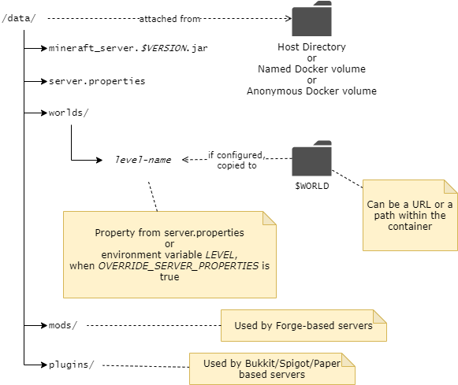
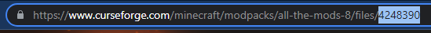

[](https://hub.docker.com/r/itzg/minecraft-server/)
[](https://hub.docker.com/r/itzg/minecraft-server/)
[](https://github.com/itzg/docker-minecraft-server/issues)
[](https://discord.gg/DXfKpjB)
[](https://github.com/itzg/docker-minecraft-server/actions)
[](https://www.buymeacoffee.com/itzg)

## Intro

This docker image provides a Minecraft Server that will automatically download the latest stable
version at startup. You can also run/upgrade to any specific version or the
latest snapshot. See the _Versions_ section below for more information.

To simply use the latest stable version, run

    docker run -d -it -p 25565:25565 -e EULA=TRUE itzg/minecraft-server

where, in this case, the standard server port 25565, will be exposed on your host machine.

> If you plan on running a server for a longer amount of time it is highly recommended using a management layer such as [Docker Compose](#using-docker-compose) or [Kubernetes](#deployment-templates-and-examples) to allow for incremental reconfiguration and image upgrades.

> Be sure to always include `-e EULA=TRUE` in your commands and container definitions, as Mojang/Microsoft requires EULA acceptance.

> **DO NOT** port forward RCON on 25575 without first setting `RCON_PASSWORD` to a secure value. It is highly recommended to only use RCON within the container, such as with `rcon-cli`. 

By default, the container will download the latest version of the "vanilla" [Minecraft: Java Edition server](https://www.minecraft.net/en-us/download/server) provided by Mojang. The [`VERSION`](#versions) and the [`TYPE`](#server-types) can be configured to create many variations of desired Minecraft server. 

## Looking for a Bedrock Dedicated Server

For Minecraft clients running on consoles, mobile, or native Windows, you'll need to
use this image instead:

[itzg/minecraft-bedrock-server](https://hub.docker.com/r/itzg/minecraft-bedrock-server)

## Interacting with the server

[RCON](http://wiki.vg/RCON) is enabled by default, so you can `exec` into the container to
access the Minecraft server console:

```
docker exec -i mc rcon-cli
```

Note: The `-i` is required for interactive use of rcon-cli.

To run a simple, one-shot command, such as stopping a Minecraft server, pass the command as arguments to `rcon-cli`, such as:

```
docker exec mc rcon-cli stop
```

_The `-i` is not needed in this case._

If rcon is disabled you can send commands by passing them as arguments to the packaged `mc-send-to-console` script. For example, a player can be op'ed in the container `mc` with: 

```shell
docker exec mc mc-send-to-console op player
            |                     |
            +- container name     +- Minecraft commands start here
```

In order to attach and interact with the Minecraft server, add `-it` when starting the container, such as

    docker run -d -it -p 25565:25565 --name mc itzg/minecraft-server

With that you can attach and interact at any time using

    docker attach mc

and then Control-p Control-q to **detach**.

For remote access, configure your Docker daemon to use a `tcp` socket (such as `-H tcp://0.0.0.0:2375`)
and attach from another machine:

    docker -H $HOST:2375 attach mc

Unless you're on a home/private LAN, you should [enable TLS access](https://docs.docker.com/articles/https/).

## Data Directory

Everything the container manages is located under the **container's** `/data` path, as shown here:



> NOTE: The container path `/data` is pre-declared as a volume, so if you do nothing then it will be allocated as an anonymous volume. As such, it is subject to removal when the container is removed. 

### Attaching data directory to host filesystem

In most cases the easiest way to persist and work with the minecraft data files is to use the [volume mounting](https://docs.docker.com/storage/volumes/) `-v` argument to map a directory on your host machine to the container's `/data` directory. In the following example, the path `/home/user/minecraft-data` **must be** a directory on your host machine:

    -v /home/user/minecraft-data:/data
       ------------------------- -----
        |                         |
        |                         +-- must always be /data
        |
        +-- replace with a directory on your host machine

When attached in this way you can stop the server, edit the configuration under your attached directory and start the server again to pick up the new configuration.

With Docker Compose, setting up a host attached directory is even easier since relative paths can be configured. For example, with the following `docker-compose.yml` Docker will automatically create/attach the relative directory `minecraft-data` to the container.

```yaml
version: "3"

services:
  mc:
    image: itzg/minecraft-server
    ports:
      - 25565:25565
    environment:
      EULA: "TRUE"
    tty: true
    stdin_open: true
    restart: unless-stopped
    volumes:
      # attach a directory relative to the directory containing this compose file
      - ./minecraft-data:/data
```

> NOTE: if you have SELinux enabled, then you might need to add `:Z` to the end of volume mount specifications, [as described here](https://prefetch.net/blog/2017/09/30/using-docker-volumes-on-selinux-enabled-servers/).

### Converting anonymous `/data` volume to named volume

If you had used the commands in the first section, without the `-v` volume attachment, then an anonymous data volume was created by Docker. You can later bring over that content to a named or host attached volume using the following procedure.

> In this example, it is assumed the original container was given a `--name` of "mc", so change the container identifier accordingly.

> You can also locate the Docker-managed directory from the `Source` field obtained from `docker inspect <container id or name> -f "{{json .Mounts}}"`

First, stop the existing container:
```shell
docker stop mc
```

Use a temporary container to copy over the anonymous volume's content into a named volume, "mc" in this case:
```shell
docker run --rm --volumes-from mc -v mc:/new alpine cp -avT /data /new
```

Now you can recreate the container with any environment variable changes, etc by attaching the named volume created from the previous step:
```shell
docker run -d -it --name mc-new -v mc:/data -p 25565:25565 -e EULA=TRUE -e MEMORY=2G itzg/minecraft-server
```

### Locating filesystem path of anonymous volume

The `Source` field from the output of this command will show where the anonymous volume is mounted from:

```shell
docker inspect -f "{{json .Mounts}}" CONTAINER_NAME_OR_ID
```

> **NOTE** On Windows with WSL the volumes path is `\\wsl$\docker-desktop-data\data\docker\volumes`

## Versions

To use a different Minecraft version, pass the `VERSION` environment variable (case sensitive), which can have the value

- LATEST (the default)
- SNAPSHOT
- or a specific version, such as "1.7.9"

For example, to use the latest snapshot:

    docker run -d -e VERSION=SNAPSHOT ...

or a specific version:

    docker run -d -e VERSION=1.7.9 ...

When using "LATEST" or "SNAPSHOT" an upgrade can be performed by simply restarting the container.
During the next startup, if a newer version is available from the respective release channel, then
the new server jar file is downloaded and used. _NOTE: over time you might see older versions of
the server jar remain in the `/data` directory. It is safe to remove those._

## Running Minecraft server on different Java version

> **For Forge versions less than 1.18, you _must_ use the `java8-multiarch` (or other java8) image tag.**

When using the image `itzg/minecraft-server` without a tag, the `latest` image tag is implied from the table below. To use a different version of Java, please use an alternate tag to run your Minecraft server container.

| Tag name          | Java version | Linux  | JVM Type    | Architecture      |
|-------------------|--------------|--------|-------------|-------------------|
| latest            | 17           | Ubuntu | Hotspot     | amd64,arm64,armv7 |
| java8             | 8            | Alpine | Hotspot     | amd64             |
| java8-jdk         | 8            | Ubuntu | Hotspot+JDK | amd64             |
| java8-multiarch   | 8            | Ubuntu | Hotspot     | amd64,arm64,armv7 |
| java8-openj9      | 8            | Debian | OpenJ9      | amd64             |
| java8-graalvm-ce  | 8            | Oracle | GraalVM CE  | amd64             |
| java11            | 11           | Ubuntu | Hotspot     | amd64,arm64,armv7 |
| java11-jdk        | 11           | Ubuntu | Hotspot+JDK | amd64,arm64,armv7 |
| java11-openj9     | 11           | Debian | OpenJ9      | amd64             |
| java17            | 17           | Ubuntu | Hotspot     | amd64,arm64,armv7 |
| java17-jdk        | 17           | Ubuntu | Hotspot+JDK | amd64,arm64,armv7 |
| java17-openj9     | 17           | Debian | OpenJ9      | amd64             |
| java17-graalvm-ce | 17           | Oracle | GraalVM CE  | amd64,arm64       |
| java17-alpine     | 17           | Alpine | Hotspot     | amd64             |
| java19            | 19           | Ubuntu | Hotspot     | amd64,arm64,armv7 |

For example, to use Java version 8 on any supported architecture:

    docker run --name mc itzg/minecraft-server:java8-multiarch

> Keep in mind that some versions of Minecraft server, such as Forge before 1.17, can't work on the newest versions of Java. Instead, one of the Java 8 images should be used. Also, FORGE doesn't support openj9 JVM implementation.
> 
> Some versions of vanilla Minecraft, such as 1.10, also do not run correctly with Java 17. If in doubt, use `java8-multiarch` for any version less than 1.17.

### Deprecated Image Tags

The following image tags have been deprecated and are no longer receiving updates:
- adopt13
- adopt14
- adopt15
- openj9-nightly
- multiarch-latest
- java16/java16-openj9

## Related Projects

### [itzg/minecraft-bedrock-server](https://github.com/itzg/docker-minecraft-bedrock-server)

Docker image that runs a Minecraft Bedrock server.

### [mc-router](https://github.com/itzg/mc-router)

Lightweight multiplexer/proxy for Minecraft Java servers. Provided as a stand-alone application and a Docker image.

### [itzg/bungeecord](https://github.com/itzg/docker-bungeecord/)

Docker image that runs a proxy powered by Bungeecord, Velocity, or Waterfall

### [itzg/mc-backup](https://github.com/itzg/docker-mc-backup)

Docker image that runs as a side-car container to backup world data.

### [rcon-cli](https://github.com/itzg/rcon-cli)

A tool that is bundled with this image to provide CLI access to an RCON endpoint.

### [mc-monitor](https://github.com/itzg/mc-monitor)

A tool that is bundled with this image that provides health checks and metrics reporting, such as a Prometheus exporter or a telegraf data source.

### [mc-image-helper](https://github.com/itzg/mc-image-helper)

A tool that is bundled with this image to provide complex, re-usable preparation operations. 

### [itzg/rcon](https://github.com/itzg/docker-rcon-web-admin)

An image that dockerizes [rcon-web-admin](https://github.com/rcon-web-admin/rcon-web-admin).

## Healthcheck

This image contains [mc-monitor](https://github.com/itzg/mc-monitor) and uses its `status` command to continually check on the container's. That can be observed from the `STATUS` column of `docker ps`

```
CONTAINER ID        IMAGE               COMMAND             CREATED             STATUS                    PORTS                                 NAMES
b418af073764        mc                  "/start"            43 seconds ago      Up 41 seconds (healthy)   0.0.0.0:25565->25565/tcp, 25575/tcp   mc
```

You can also query the container's health in a script friendly way:

```
> docker container inspect -f "{{.State.Health.Status}}" mc
healthy
```

There's actually a wrapper script called `mc-health` that takes care of calling `mc-monitor status` with the correct arguments. If needing to customize the health checks parameters, such as in a compose file, then use something like the following in the service declaration:

```yaml
healthcheck:
  test: mc-health
  start_period: 1m
  interval: 5s
  retries: 20
```

Some orchestration systems, such as Portainer, don't allow for disabling the default `HEALTHCHECK` declared by this image. In those cases you can approximate the disabling of healthchecks by setting the environment variable `DISABLE_HEALTHCHECK` to `true`.

## Deployment Templates and Examples

### Helm Charts

- itzg Helm Chart:
  - [GitHub repo](https://github.com/itzg/minecraft-server-charts)
  - [Helm Chart repo](https://itzg.github.io/minecraft-server-charts/)
- [mcsh/server-deployment](https://github.com/mcserverhosting-net/charts)

### Examples

The [examples directory](https://github.com/itzg/docker-minecraft-server/tree/master/examples) also provides examples of deploying the [itzg/minecraft-server](https://hub.docker.com/r/itzg/minecraft-server/) Docker image.

### Amazon Web Services (AWS) Deployment

If you're looking for a simple way to deploy this to the Amazon Web Services Cloud, check out the [Minecraft Server Deployment (CloudFormation) repository](https://github.com/vatertime/minecraft-spot-pricing). This repository contains a CloudFormation template that will get you up and running in AWS in a matter of minutes. Optionally it uses Spot Pricing so the server is very cheap, and you can easily turn it off when not in use.

### Using Docker Compose

Rather than type the server options below, the port mappings above, etc
every time you want to create new Minecraft server, you can now use
[Docker Compose](https://docs.docker.com/compose/). Start with a
`docker-compose.yml` file like the following:

```yml
version: "3"

services:
  mc:
    image: itzg/minecraft-server
    ports:
      - 25565:25565
    environment:
      EULA: "TRUE"
    tty: true
    stdin_open: true
    restart: unless-stopped
```

and in the same directory as that file run

    docker-compose up -d

Now, go play...or adjust the `environment` section to configure
this server instance.

## Troubleshooting

To troubleshoot the container initialization, such as when server files are pre-downloaded, set the environment variable `DEBUG` to `true`. The container logs will include **much more** output, and it is highly recommended including that output when reporting any [issues](https://github.com/itzg/docker-minecraft-server/issues).

To troubleshoot just the command-line used to start the Minecraft server, set the environment variable `DEBUG_EXEC` to `true`.

To troubleshoot any issues with memory allocation reported by the JVM, set the environment variable `DEBUG_MEMORY` to `true`.

## Server types

### Running a Forge Server

Enable [Forge server](http://www.minecraftforge.net/) mode by adding a `-e TYPE=FORGE` to your command-line.

The overall version is specified by `VERSION`, [as described in the section above](#versions) and will run the recommended Forge version by default. You can also choose to run a specific Forge version with `FORGE_VERSION`, such as `-e FORGE_VERSION=14.23.5.2854`.

    docker run -d -v /path/on/host:/data \
        -e TYPE=FORGE \
        -e VERSION=1.12.2 -e FORGE_VERSION=14.23.5.2854 \
        -p 25565:25565 -e EULA=TRUE --name mc itzg/minecraft-server

To use a pre-downloaded Forge installer, place it in the attached `/data` directory and
specify the name of the installer file with `FORGE_INSTALLER`, such as:

    docker run -d -v /path/on/host:/data ... \
        -e FORGE_INSTALLER=forge-1.11.2-13.20.0.2228-installer.jar ...

To download a Forge installer from a custom location, such as your own file repository, specify
the URL with `FORGE_INSTALLER_URL`, such as:

    docker run -d -v /path/on/host:/data ... \
        -e FORGE_INSTALLER_URL=http://HOST/forge-1.11.2-13.20.0.2228-installer.jar ...

In both of the cases above, there is no need for the `VERSION` or `FORGEVERSION` variables.

> If an error occurred while installing Forge, it might be possible to resolve by temporarily setting `FORGE_FORCE_REINSTALL` to "true". Be sure to remove that variable after successfully starting the server.

### Running a Fabric Server

Enable [Fabric server](https://fabricmc.net/) mode by adding a `-e TYPE=FABRIC` to your command-line.

```
docker run -d -v /path/on/host:/data \
    -e TYPE=FABRIC \
    -p 25565:25565 -e EULA=TRUE --name mc itzg/minecraft-server
```

By default, the container will install the latest [fabric server launcher](https://fabricmc.net/use/server/), using the latest [fabric-loader](https://fabricmc.net/wiki/documentation:fabric_loader) against the minecraft version you have defined with `VERSION` (defaulting to the latest vanilla release of the game).

A specific loader or launcher version other than the latest can be requested using `FABRIC_LOADER_VERSION` and `FABRIC_LAUNCHER_VERSION` respectively, such as:

```
docker run -d -v /path/on/host:/data ... \
    -e TYPE=FABRIC \
    -e FABRIC_LAUNCHER_VERSION=0.10.2 \
    -e FABRIC_LOADER_VERSION=0.13.1
```

> If you wish to use an alternative launcher you can:
> * Provide the path to a custom launcher jar available to the container with `FABRIC_LAUNCHER`, relative to `/data` (such as `-e FABRIC_LAUNCHER=fabric-server-custom.jar`)
> * Provide the URL to a custom launcher jar with `FABRIC_LAUNCHER_URL` (such as `-e FABRIC_LAUNCHER_URL=http://HOST/fabric-server-custom.jar`)

See the [Working with mods and plugins](#working-with-mods-and-plugins) section to set up Fabric mods and configuration.

### Running a Quilt Server

Enable [Quilt server](https://quiltmc.org/) mode by adding a `-e TYPE=QUILT` to your command-line.

```
docker run -d -v /path/on/host:/data \
    -e TYPE=QUILT \
    -p 25565:25565 -e EULA=TRUE --name mc itzg/minecraft-server
```

By default, the container will install the latest [quilt server launcher](https://quiltmc.org/install/server/), using the latest [quilt-installer](https://github.com/QuiltMC/quilt-installer) against the minecraft version you have defined with `VERSION` (defaulting to the latest vanilla release of the game).

A specific loader or installer version other than the latest can be requested using `QUILT_LOADER_VERSION` and `QUILT_INSTALLER_VERSION` respectively, such as:

```
docker run -d -v /path/on/host:/data ... \
    -e TYPE=QUILT \
    -e QUILT_LOADER_VERSION=0.16.0 \
    -e QUILT_INSTALLER_VERSION=0.4.1
```

> If you wish to use an alternative launcher you can: 
> * Provide the path to a custom launcher jar available to the container with `QUILT_LAUNCHER`, relative to `/data` (such as `-e QUILT_LAUNCHER=quilt-server-custom.jar`)
> * Provide the URL to a custom launcher jar with `QUILT_LAUNCHER_URL` (such as `-e QUILT_LAUNCHER_URL=http://HOST/quilt-server-custom.jar`)

See the [Working with mods and plugins](#working-with-mods-and-plugins) section to set up Quilt mods and configuration.

### Running a Bukkit/Spigot server

Enable Bukkit/Spigot server mode by adding a `-e TYPE=BUKKIT` or `-e TYPE=SPIGOT` to your command-line.

    docker run -d -v /path/on/host:/data \
        -e TYPE=SPIGOT \
        -p 25565:25565 -e EULA=TRUE --name mc itzg/minecraft-server

If the downloaded server jar is corrupted, set `FORCE_REDOWNLOAD` to "true" to force a re-download during next container startup. After successfully re-downloading, you should remove that or set to "false".

If you are hosting your own copy of Bukkit/Spigot you can override the download URLs with:

- -e BUKKIT_DOWNLOAD_URL=<url>
- -e SPIGOT_DOWNLOAD_URL=<url>

You can build spigot from source by adding `-e BUILD_FROM_SOURCE=true`

Plugins can either be managed within the `plugins` subdirectory of the [data directory](#data-directory) or you can also [attach a `/plugins` volume](#optional-plugins-mods-and-config-attach-points). If you add plugins while the container is running, you'll need to restart it to pick those up.

[You can also auto-download plugins using `SPIGET_RESOURCES`.](#auto-downloading-spigotmcbukkitpapermc-plugins-with-spiget)

> NOTE some of the `VERSION` values are not as intuitive as you would think, so make sure to click into the version entry to find the **exact** version needed for the download. For example, "1.8" is not sufficient since their download naming expects `1.8-R0.1-SNAPSHOT-latest` exactly.

### Running a Paper server

Enable Paper server mode by adding a `-e TYPE=PAPER` to your command-line.

By default, the container will run the latest build of [Paper server](https://papermc.io/downloads) but you can also choose to run a specific build with `-e PAPERBUILD=205`.

    docker run -d -v /path/on/host:/data \
        -e TYPE=PAPER \
        -p 25565:25565 -e EULA=TRUE --name mc itzg/minecraft-server

If you are hosting your own copy of Paper you can override the download URL with `PAPER_DOWNLOAD_URL=<url>`.

If you have attached a host directory to the `/data` volume, then you can install plugins via the `plugins` subdirectory. You can also [attach a `/plugins` volume](#optional-plugins-mods-and-config-attach-points). If you add plugins while the container is running, you'll need to restart it to pick those up.

[You can also auto-download plugins using `SPIGET_RESOURCES`.](#auto-downloading-spigotmcbukkitpapermc-plugins-with-spiget)

### Running a Pufferfish server

A [Pufferfish](https://github.com/pufferfish-gg/Pufferfish) server, which is "a highly optimized Paper fork designed for large servers requiring both maximum performance, stability, and "enterprise" features."

    -e TYPE=PUFFERFISH

> NOTE: The `VERSION` variable is used to select branch latest, 1.18, or 1.17. Use PUFFERFISH_BUILD to really select the SERVER VERSION number.

Extra variables:
- `PUFFERFISH_BUILD=lastSuccessfulBuild` : set a specific Pufferfish build to use. Example: selecting build 47 => 1.18.1, or build 50 => 1.18.2 etc
- `FORCE_REDOWNLOAD=false` : set to true to force the located server jar to be re-downloaded
- `USE_FLARE_FLAGS=false` : set to true to add appropriate flags for the built-in [Flare](https://blog.airplane.gg/flare) profiler

### Running a Purpur server

A [Purpur](https://purpurmc.org/) server, which is "a drop-in replacement for Paper servers designed for configurability and new, fun, exciting gameplay features."

    -e TYPE=PURPUR

> NOTE: the `VERSION` variable is used to lookup a build of Purpur to download

Extra variables:
- `PURPUR_BUILD=LATEST` : set a specific Purpur build to use
- `FORCE_REDOWNLOAD=false` : set to true to force the located server jar to be re-downloaded
- `USE_FLARE_FLAGS=false` : set to true to add appropriate flags for the built-in [Flare](https://blog.airplane.gg/flare) profiler
- `PURPUR_DOWNLOAD_URL=<url>` : set URL to download Purpur from custom URL.

### Running a Magma server

A [Magma](https://magmafoundation.org/) server, which is a combination of Forge and PaperMC, can be used with

    -e TYPE=MAGMA

> **NOTE** there are limited base versions supported, so you will also need to  set `VERSION`, such as "1.12.2", "1.16.5", etc.


### Running a Mohist server

A [Mohist](https://github.com/MohistMC/Mohist) server can be used with

    -e TYPE=MOHIST

> **NOTE** there are limited base versions supported, so you will also need to  set `VERSION`, such as "1.12.2"

By default the latest build will be used; however, a specific build number can be selected by setting `MOHIST_BUILD`, such as

    -e VERSION=1.16.5 -e MOHIST_BUILD=374

### Running a Catserver type server

A [Catserver](http://catserver.moe/) type server can be used with

    -e TYPE=CATSERVER

> **NOTE** Catserver only provides a single release stream, so `VERSION` is ignored

### Running a Loliserver type server

A [Loliserver](https://github.com/Loli-Server/LoliServer) type server can be used with

    -e TYPE=LOLISERVER

> **NOTE** Loliserver only provides a single release stream, so `VERSION` is ignored

> **Disclaimer** The retrieval of the serverjar is not bulletproof. It can and probably will change in the future.

### Running a Canyon server

[Canyon](https://github.com/canyonmodded/canyon) is a fork of CraftBukkit for Minecraft Beta 1.7.3. It includes multiple enhancements whilst also retaining compatibility with old Bukkit plugins and mods as much as possible.

    -e VERSION=b1.7.3 -e TYPE=CANYON

> **NOTE** only `VERSION=b1.7.3` is supported. Since that version pre-dates the health check mechanism used by this image, that will need to be disabled by setting `DISABLE_HEALTHCHECK=true`.

By default, the latest build will be used; however, a specific build number can be selected by setting `CANYON_BUILD`, such as

    -e CANYON_BUILD=11

### Running a SpongeVanilla server

Enable SpongeVanilla server mode by adding a `-e TYPE=SPONGEVANILLA` to your command-line.
    
By default the container will run the latest `STABLE` version.
If you want to run a specific version, you can add `-e SPONGEVERSION=1.11.2-6.1.0-BETA-19` to your command-line.
    
Beware that current [Sponge](https://www.spongepowered.org) `STABLE` versions for Minecraft 1.12 require using [the Java 8 tag](#running-minecraft-server-on-different-java-version):
    
    docker run -d -v /path/on/host:/data -e TYPE=SPONGEVANILLA \
        -p 25565:25565 -e EULA=TRUE --name mc itzg/minecraft-server:java8-multiarch

You can also choose to use the `EXPERIMENTAL` branch.
Just change it with `SPONGEBRANCH`, such as:

    $ docker run -d -v /path/on/host:/data ... \
        -e TYPE=SPONGEVANILLA -e SPONGEBRANCH=EXPERIMENTAL ...

### Running a Limbo server

A [Limbo](https://github.com/LOOHP/Limbo) server can be run by setting `TYPE` to `LIMBO`.

Configuration options with defaults:

- `LIMBO_BUILD`=LATEST

  The `VERSION` will be ignored so locate the appropriate value from [here](https://ci.loohpjames.com/job/Limbo/) to match the version expected by clients.

- `FORCE_REDOWNLOAD`=false
- `LIMBO_SCHEMA_FILENAME`=default.schem
- `LEVEL`="Default;${LIMBO_SCHEMA


NAME}"

> NOTE: instead of using format codes in the MOTD, Limbo requires [JSON chat content](https://minecraft.fandom.com/wiki/Raw_JSON_text_format#Java_Edition). If a plain string is provided, which is the default, then it gets converted into the required JSON structure. 

### Running a Crucible server

A [Crucible](https://github.com/CrucibleMC/Crucible) server can be run by setting `TYPE` to `CRUCIBLE`.

Configuration options with defaults:

- `CRUCIBLE_RELEASE`=latest

Crucible is only available for 1.7.10, so be sure to set `VERSION=1.7.10`.

## Running a server with a Feed the Beast modpack

> **NOTE** requires one of the Ubuntu with Hotspot images listed in [the Java versions section](#running-minecraft-server-on-different-java-version).

[Feed the Beast application](https://www.feed-the-beast.com/) modpacks are supported by using `-e TYPE=FTBA` (**note** the "A" at the end of the type). This server type will automatically take care of downloading and installing the modpack and appropriate version of Forge, so the `VERSION` does not need to be specified.

### Environment Variables:
- `FTB_MODPACK_ID`: **required**, the numerical ID of the modpack to install. The ID can be located by [finding the modpack](https://www.feed-the-beast.com/modpack) and locating the ID in this part of the URL:
  ```
  https://www.feed-the-beast.com/modpacks/23-ftb-infinity-evolved-17
                                          ^^
  ```
- `FTB_MODPACK_VERSION_ID`: optional, the numerical ID of the version to install. If not specified, the latest version will be installed. The "Version ID" can be obtained by hovering over a server file entry and grabbing [this ID in the URL](docs/ftba-version-id-popup.png).

### Upgrading

If a specific `FTB_MODPACK_VERSION_ID` was not specified, simply restart the container to pick up the newest modpack version. If using a specific version ID, recreate the container with the new version ID.

### Example

The following example runs the latest version of [FTB Presents Direwolf20 1.12](https://ftb.neptunepowered.org/pack/ftb-presents-direwolf20-1-12/):

```
docker run -d --name mc-ftb -e EULA=TRUE \
  -e TYPE=FTBA -e FTB_MODPACK_ID=31 \
  -p 25565:25565 \
  itzg/minecraft-server:java8-multiarch
```

> Normally you will also add `-v` volume for `/data` since the mods and config are installed there along with world data.

## Running a server with a CurseForge modpack

### Auto CurseForge Management

To manage a CurseForge modpack automatically with upgrade support, pinned or latest version tracking, set `TYPE` to "AUTO_CURSEFORGE". The appropriate mod loader (Forge / Fabric) version will be automatically installed as declared by the modpack. This mode will also take care of cleaning up unused files installed by previous versions of the modpack, but world data is never auto-removed.

> **NOTES:**
> Be sure to use the appropriate [image tag for the Java version compatible with the modpack](#running-minecraft-server-on-different-java-version).
> 
> Most modpacks require a good amount of memory, so it best to set `MEMORY` to at least "4G" since the default is only 1 GB.

Use one of the following to specify the modpack to install:

Pass a page URL to the modpack or a specific file with `CF_PAGE_URL` such as the modpack page "https://www.curseforge.com/minecraft/modpacks/all-the-mods-8" or a specific file "https://www.curseforge.com/minecraft/modpacks/all-the-mods-8/files/4248390". For example:

```
-e TYPE=AUTO_CURSEFORGE -e CF_PAGE_URL=https://www.curseforge.com/minecraft/modpacks/all-the-mods-8
```

Instead of a URL, the modpack slug can be provided as `CF_SLUG`. The slug is the short identifier visible in the URL after "/modpacks/", such as


For example:
```
-e TYPE=AUTO_CURSEFORGE -e CF_SLUG=all-the-mods-8
```

The latest file will be located and used by default, but if a specific version is desired you can use one of the following options. With any of these options **do not select a server file** -- they lack the required manifest and defeat the ability to consistently automate startup.

- Use `CF_PAGE_URL`, but include the full URL to a specific file
- Set `CF_FILE_ID` to the numerical file ID 
- Specify a substring to match the desired filename with `CF_FILENAME_MATCHER`

The following shows where to get the URL to the specific file and also shows where the file ID is located:



The following examples all refer to version 1.0.7 of ATM8:

```
-e CF_PAGE_URL=https://www.curseforge.com/minecraft/modpacks/all-the-mods-8/files/4248390
```

```
-e CF_SLUG=all-the-mods-8 -e CF_FILE_ID=4248390
```

```
-e CF_SLUG=all-the-mods-8 -e CF_FILENAME_MATCHER=1.0.7
```

Quite often there are mods that need to be excluded, such as ones that did not properly declare as a client mod via the file's game versions. Similarly, there are some mods that are incorrectly tagged as client only. The following describes two options to exclude/include mods:

Global and per modpack exclusions can be declared in a JSON file and referenced with `CF_EXCLUDE_INCLUDE_FILE`. By default, [the file bundled with the image](files/cf-exclude-include.json) will be used. The schema of this file [is documented here](https://github.com/itzg/mc-image-helper#excludeinclude-file-schema).

Alternatively, they can be excluded by passing a comma or space delimited list of **project** slugs or IDs via `CF_EXCLUDE_MODS`. Similarly, there are some mods that are incorrectly tagged as client only. For those, pass the **project** slugs or IDs via `CF_FORCE_INCLUDE_MODS`. If either of these are set, then `CF_EXCLUDE_INCLUDE_FILE` will be **disabled**.

A mod's project ID can be obtained from the right hand side of the project page:


If needing to iterate on the options above, set `CF_FORCE_SYNCHRONIZE` to "true" to ensure the exclude/includes are re-evaluated.

> **NOTE:** these options are provided to empower you to get your server up and running quickly. Please help out by reporting an issue with the respective mod project. Ideally mod developers should [use correct registrations for one-sided client mods](https://docs.minecraftforge.net/en/latest/concepts/sides/#writing-one-sided-mods). Understandably, those code changes may be non-trivial, so mod authors can also add "Client" to the game versions when publishing.

Some modpacks come with world/save data via a worlds file and/or the overrides provided with the modpack. Either approach can be selected to set the `LEVEL` to the resulting saves directory by setting `CF_SET_LEVEL_FROM` to either:
- `WORLD_FILE`
- `OVERRIDES`

Other configuration available:
- `CF_PARALLEL_DOWNLOADS` (default is 4): specify how many parallel mod downloads to perform
- `CF_OVERRIDES_SKIP_EXISTING` (default is false): if set, files in the overrides that already exist in the data directory are skipped. **NOTE** world data is always skipped, if present.

### Old approach

Enable this server mode by adding `-e TYPE=CURSEFORGE` to your command-line,
but note the following additional steps needed...

You need to specify a modpack to run, using the `CF_SERVER_MOD` environment
variable. A CurseForge server modpack is available together with its respective
client modpack at <https://www.curseforge.com/minecraft/modpacks> .

Now you can add a `-e CF_SERVER_MOD=name_of_modpack.zip` to your command-line.

    docker run -d -v /path/on/host:/data -e TYPE=CURSEFORGE \
        -e CF_SERVER_MOD=SkyFactory_4_Server_4.1.0.zip \
        -p 25565:25565 -e EULA=TRUE --name mc itzg/minecraft-server

If you want to keep the pre-download modpacks separate from your data directory,
then you can attach another volume at a path of your choosing and reference that.
The following example uses `/modpacks` as the container path as the pre-download area:

    docker run -d -v /path/on/host:/data -v /path/to/modpacks:/modpacks \
        -e TYPE=CURSEFORGE \
        -e CF_SERVER_MOD=/modpacks/SkyFactory_4_Server_4.1.0.zip \
        -p 25565:25565 -e EULA=TRUE --name mc itzg/minecraft-server

### Modpack data directory

By default, CurseForge modpacks are expanded into the sub-directory `/data/FeedTheBeast` and executed from there. (The default location was chosen for legacy reasons, when Curse and FTB were maintained together.)

The directory can be changed by setting `CF_BASE_DIR`, such as `-e CF_BASE_DIR=/data`.

### Buggy start scripts

Some modpacks have buggy or overly complex start scripts. You can avoid using the bundled start script and use this image's standard server-starting logic by adding `-e USE_MODPACK_START_SCRIPT=false`.

### Fixing "unable to launch forgemodloader"

If your server's modpack fails to load with an error [like this](https://support.feed-the-beast.com/t/cant-start-crashlanding-server-unable-to-launch-forgemodloader/6028/2):

    unable to launch forgemodloader

then you apply a workaround by adding this to the run invocation:

    -e FTB_LEGACYJAVAFIXER=true

## Running a server with a packwiz modpack

[packwiz](https://packwiz.infra.link/) is a CLI tool for maintaining and providing modpack definitions, with support for both CurseForge and Modrinth as sources. See the [packwiz tutorial](https://packwiz.infra.link/tutorials/getting-started/) for more information.

To configure server mods using a packwiz modpack, set the `PACKWIZ_URL` environment variable to the location of your `pack.toml` modpack definition:

    docker run -d -v /path/on/host:/data -e TYPE=FABRIC \
        -e "PACKWIZ_URL=https://example.com/modpack/pack.toml" \
        itzg/minecraft-server

packwiz modpack defitions are processed before other mod definitions (`MODPACK`, `MODS`, etc.) to allow for additional processing/overrides you may want to perform (in case of mods not available via Modrinth/CurseForge, or you do not maintain the pack).

> packwiz is pre-configured to only download server mods. If client-side mods are downloaded and cause issues, check your pack.toml configuration, and make sure any client-only mods are not set to `"both"`, but rather `"client"` for the side configuration item.

## Working with mods and plugins

### Optional plugins, mods, and config attach points

There are optional volume paths that can be attached to supply content to be copied into the data area:

`/plugins`
: contents are synchronized into `/data/plugins` for Bukkit related server types. The source can be changed by setting `COPY_PLUGINS_SRC`. The destination can be changed by setting `COPY_PLUGINS_DEST`. Set `SYNC_SKIP_NEWER_IN_DESTINATION=false` if you want files from `/plugins` to take precedence over newer files in `/data/plugins`.

`/mods`
: contents are synchronized into `/data/mods` for Fabric and Forge related server types. The source can be changed by setting `COPY_MODS_SRC`. The destination can be changed by setting `COPY_MODS_DEST`.

`/config`
: contents are synchronized into `/data/config` by default, but can be changed with `COPY_CONFIG_DEST`. The source can be changed by setting `COPY_CONFIG_SRC`. For example, `-v ./config:/config -e COPY_CONFIG_DEST=/data` will allow you to copy over files like `bukkit.yml` and so on directly into the server directory. Set `SYNC_SKIP_NEWER_IN_DESTINATION=false` if you want files from `/config` to take precedence over newer files in `/data/config`.

By default, the [environment variable processing](#replacing-variables-inside-configs) is performed on synchronized files that match the expected suffixes in `REPLACE_ENV_SUFFIXES` (by default "yml,yaml,txt,cfg,conf,properties,hjson,json,tml,toml") and are not excluded by `REPLACE_ENV_VARIABLES_EXCLUDES` and `REPLACE_ENV_VARIABLES_EXCLUDE_PATHS`. This processing can be disabled by setting `REPLACE_ENV_DURING_SYNC` to `false`.

If you want old mods/plugins to be removed before the content is brought over from those attach points, then add `-e REMOVE_OLD_MODS=TRUE`. You can fine tune the removal process by specifying the `REMOVE_OLD_MODS_INCLUDE` and `REMOVE_OLD_MODS_EXCLUDE` variables, which are comma separated lists of file glob patterns. If a directory is excluded, then it and all of its contents are excluded. By default, only jars are removed. 

You can also specify the `REMOVE_OLD_MODS_DEPTH` (default is 16) variable to only delete files up to a certain level.

For example: `-e REMOVE_OLD_MODS=TRUE -e REMOVE_OLD_MODS_INCLUDE="*.jar" -e REMOVE_OLD_MODS_DEPTH=1` will remove all old jar files that are directly inside the `plugins/` or `mods/` directory.

These paths work well if you want to have a common set of modules in a separate location, but still have multiple worlds with different server requirements in either persistent volumes or a downloadable archive.

> For more flexibility with mods/plugins preparation, you can declare directories to use in [the `MODS` variable](#downloadable-modplugin-pack-for-forge-fabric-and-bukkit-like-servers)

### Auto-downloading SpigotMC/Bukkit/PaperMC plugins with Spiget

The `SPIGET_RESOURCES` variable can be set with a comma-separated list of SpigotMC resource IDs to automatically download [SpigotMC resources/plugins](https://www.spigotmc.org/resources/) using [the spiget API](https://spiget.org/). Resources that are zip files will be expanded into the plugins directory and resources that are simply jar files will be moved there.

> NOTE: the variable is purposely spelled SPIG**E**T with an "E"

The **resource ID** can be located from the numerical part of the URL after the shortname and a dot. For example, the ID is **9089** from

    https://www.spigotmc.org/resources/essentialsx.9089/
                                                   ====

For example, the following will auto-download the [EssentialsX](https://www.spigotmc.org/resources/essentialsx.9089/) and [Vault](https://www.spigotmc.org/resources/vault.34315/) plugins:

    -e SPIGET_RESOURCES=9089,34315

### Auto-download mods from Modrinth

[Modrinth](https://modrinth.com/) is an open source modding platform with a clean, easy to use website for finding [Fabric and Forge mods](https://modrinth.com/mods). At startup, the container will automatically locate and download the newest versions of mod files that correspond to the `TYPE` and `VERSION` in use. Older file versions downloaded previously will automatically be cleaned up.

- **MODRINTH_PROJECTS** : comma separated list of project slugs (short name) or IDs. The project ID can be located in the "Technical information" section. The slug is the part of the page URL that follows `/mod/`:
  ```
    https://modrinth.com/mod/fabric-api
                             ----------
                              |
                              +-- project slug
  ```
  Also, specific version/type can be declared using colon symbol and version id/type after the project slug. The version id can be found at 'Metadata' section. Valid version types are `release`, `beta`, `alpha`. For instance:
  ```
    -e MODRINTH_PROJECTS=fabric-api,fabric-api:PbVeub96,fabric-api:beta
  ```
- **MODRINTH_DOWNLOAD_OPTIONAL_DEPENDENCIES**=true : required dependencies of the project will _always_ be downloaded and optional dependencies can also be downloaded by setting this to `true`
- **MODRINTH_ALLOWED_VERSION_TYPE**=release : the version type is used to determine the newest version to use from each project. The allowed values are `release`, `beta`, `alpha`.

### Downloadable mod/plugin pack for Forge, Fabric, and Bukkit-like Servers

Like the `WORLD` option above, you can specify the URL or path of a "mod pack"
to download and install into `mods` for Forge/Fabric or `plugins` for Bukkit/Spigot.
To use this option pass the environment variable `MODPACK`, such as

    docker run -d -e MODPACK=http://www.example.com/mods/modpack.zip ...

**NOTE:** The referenced URL must be a zip file with one or more jar files at the
top level of the zip archive. Make sure the jars are compatible with the
particular `TYPE` of server you are running.

You may also download or copy over individual mods using the `MODS` environment variable. `MODS` contains a comma-separated list of
- URL of a jar file
- container path to a jar file
- container path to a directory containing jar files

  docker run -d -e MODS=https://www.example.com/mods/mod1.jar,/plugins/common,/plugins/special/mod2.jar ...

### ForgeAPI usage to use non-version specific projects

**NOTE:** This potentially could lead to unexpected behavior if the Mod receives an update with unexpected behavior.

This is more complicated because you will be pulling/using the latest mod for the release of your game. To get started make sure you have a [CursedForge API Key](https://docs.curseforge.com/#getting-started). Then use the environmental parameters in your docker build.

Please be aware of the following when using these options for your mods:
* Mod Release types: Release, Beta, and Alpha.
* Mod dependencies: Required and Optional
* Mod family: Fabric, Forge, and Bukkit.

Parameters to use the ForgeAPI:

* `MODS_FORGEAPI_KEY` - Required
* `MODS_FORGEAPI_FILE` - Required or use MODS_FORGEAPI_PROJECTIDS (Overrides MODS_FORGEAPI_PROJECTIDS)
* `MODS_FORGEAPI_PROJECTIDS` - Required or use MODS_FORGEAPI_FILE
* `MODS_FORGEAPI_RELEASES` - Default is release, Options: [Release|Beta|Alpha]
* `MODS_FORGEAPI_DOWNLOAD_DEPENDENCIES` - Default is False, attempts to download required mods (releaseType Release) defined in Forge.
* `MODS_FORGEAPI_IGNORE_GAMETYPE` - Default is False, Allows for filtering mods on family type: FORGE, FABRIC, and BUKKIT. (Does not filter for Vanilla or custom)
* `REMOVE_OLD_FORGEAPI_MODS` - Default is False
* `REMOVE_OLD_DATAPACKS_DEPTH` - Default is 1
* `REMOVE_OLD_DATAPACKS_INCLUDE` - Default is *.jar

Example of expected forge api project ids, releases, and key: 

```yaml
  MODS_FORGEAPI_PROJECTIDS: 306612,256717
  MODS_FORGEAPI_RELEASES: Release
  MODS_FORGEAPI_KEY: $WRX...
```

Example of expected ForgeAPI file format.

**Field Description**: 
* `name` is currently unused, but can be used to document each entry.
* `projectId` id is the id found on the CurseForge website for a particular mod
* `releaseType` Type corresponds to forge's R, B, A icon for each file. Default Release, options are (release|beta|alpha).
* `fileName` is used for version pinning if latest file will not work for you.

```json
[
  {
      "name": "fabric api",
      "projectId": "306612",
      "releaseType": "release"
  },
  {
      "name": "fabric voice mod",
      "projectId": "416089",
      "releaseType": "beta"
  },
  {
      "name": "Biomes o plenty",
      "projectId": "220318",
      "fileName": "BiomesOPlenty-1.18.1-15.0.0.100-universal.jar",
      "releaseType": "release"
  }
]
```

### Generic pack files

To install all the server content (jars, mods, plugins, configs, etc.) from a zip or tgz file, then set `GENERIC_PACK` to the container path or URL of the archive file. This can also be used to apply a CurseForge modpack that is missing a server start script and/or Forge installer.

If multiple generic packs need to be applied together, set `GENERIC_PACKS` instead, with a comma separated list of archive file paths and/or URLs to files.

To avoid repetition, each entry will be prefixed by the value of `GENERIC_PACKS_PREFIX` and suffixed by the value of `GENERIC_PACKS_SUFFIX`, both of which are optional. For example, the following variables

```
GENERIC_PACKS=configs-v9.0.1,mods-v4.3.6
GENERIC_PACKS_PREFIX=https://cdn.example.org/
GENERIC_PACKS_SUFFIX=.zip
```

would expand to `https://cdn.example.org/configs-v9.0.1.zip,https://cdn.example.org/mods-v4.3.6.zip`.

If applying large generic packs, the update can be time-consuming. To skip the update set `SKIP_GENERIC_PACK_UPDATE_CHECK` to "true". Conversely, the generic pack(s) can be forced to be applied by setting `FORCE_GENERIC_PACK_UPDATE` to "true".

The most time consuming portion of the generic pack update is generating and comparing the SHA1 checksum. To skip the checksum generation, set `SKIP_GENERIC_PACK_CHECKSUM` to "true.

### Mod/Plugin URL Listing File 

As an alternative to `MODS`, the variable `MODS_FILE` can be set with the path to a text file listing a mod/plugin URL on each line. For example, the following

     -e MODS_FILE=/extras/mods.txt

would load from a file mounted into the container at `/extras/mods.txt`. That file might look like:

```text
https://edge.forgecdn.net/files/2965/233/Bookshelf-1.15.2-5.6.40.jar
https://edge.forgecdn.net/files/2926/27/ProgressiveBosses-2.1.5-mc1.15.2.jar
# This and next line are ignored
#https://edge.forgecdn.net/files/3248/905/goblintraders-1.3.1-1.15.2.jar
https://edge.forgecdn.net/files/3272/32/jei-1.15.2-6.0.3.16.jar
https://edge.forgecdn.net/files/2871/647/ToastControl-1.15.2-3.0.1.jar
```
> Blank lines and lines that start with a `#` will be ignored

> [This compose file](examples/docker-compose-mods-file.yml) shows another example of using this feature.

> It is recommended to combine this option with `REMOVE_OLD_MODS=TRUE` to ensure the mods/plugins remain consistent with the file's listing.

### Remove old mods/plugins

When the option above is specified (`MODPACK`) you can also instruct script to
delete old mods/plugins prior to installing new ones. This behaviour is desirable
in case you want to upgrade mods/plugins from downloaded zip file.
To use this option pass the environment variable `REMOVE_OLD_MODS=TRUE`, such as

    docker run -d -e REMOVE_OLD_MODS=TRUE -e MODPACK=http://www.example.com/mods/modpack.zip ...

**WARNING:** All content of the `mods` or `plugins` directory will be deleted
before unpacking new content from the MODPACK or MODS.

## Working with world data

### Downloadable world

Instead of mounting the `/data` volume, you can instead specify the URL of a ZIP or compressed TAR file containing an archived world. It will be searched for a file `level.dat` and the containing subdirectory moved to the directory named by `$LEVEL`. This means that most of the archived Minecraft worlds downloadable from the Internet will already be in the correct format.

    docker run -d -e WORLD=http://www.example.com/worlds/MySave.zip ...

**NOTE:** This URL must be accessible from inside the container. Therefore, you should use an IP address or a globally resolvable FQDN, or else the name of a linked container.

**NOTE:** If the archive contains more than one `level.dat`, then the one to select can be picked with `WORLD_INDEX`, which defaults to 1.

### Cloning world from a container path

The `WORLD` option can also be used to reference a directory, zip file, or compressed tar file that will be used as a source to clone or extract the world directory.

For example, the following would initially clone the world's content from `/worlds/basic`. Also notice in the example that you should use a read-only volume attachment to ensure the clone source remains pristine.

```
docker run ... -v $HOME/worlds:/worlds:ro -e WORLD=/worlds/basic
```

The following diagram shows how this option can be used in a compose deployment with a relative directory:


### Overwrite world on start
The world will only be downloaded or copied if it doesn't exist already. Set `FORCE_WORLD_COPY=TRUE` to force overwrite the world on every server start.

### Custom worlds directory path
To set a custom worlds directory for the Multiverse plugin on a baremetal server, you'd pass the `--world-dir` argument after the jar file.
In order to accomplish the same in a containerized server, set the `EXTRA_ARGS` environment variable in your command line or docker compose yaml to the same argument string. For example:
```
docker run -d -e EXTRA_ARGS='--world-dir ./worlds/'
```
`--world-container`, `-W`, and `--universe` are aliases to `--world-dir` and can also be used.

### Datapacks
Datapacks can be installed in a similar manner to mods/plugins. There are many environment variables which function in the same way they do for [mods](#working-with-mods-and-plugins): 

* `DATAPACKS`: comma-separated list of zip file URL, zip file in container, or directory in container
* `DATAPACKS_FILE`: a text file within the container where each line is a zip file URL, zip file in container, or directory in container
* `REMOVE_OLD_DATAPACKS`: if "true" the datapacks directory is removed of everything matching `REMOVE_OLD_DATAPACKS_INCLUDE`, but excluding `REMOVE_OLD_DATAPACKS_EXCLUDE` no deeper than `REMOVE_OLD_DATAPACKS_DEPTH`
* `REMOVE_OLD_DATAPACKS_DEPTH`: default is 16
* `REMOVE_OLD_DATAPACKS_INCLUDE`: default is `*.zip`
* `REMOVE_OLD_DATAPACKS_EXCLUDE`: default is empty

Datapacks will be placed in `/data/$LEVEL/datapacks`

### VanillaTweaks

[VanillaTweaks](https://vanillatweaks.net/) datapacks, crafting tweaks, and resource packs can be installed with a share code from the website **OR** a json file to specify packs to download and install. Datapacks and crafting tweaks will be installed into the current world directory specified by `$LEVEL`. As new versions of the packs are retrieved the previous versions will automatically be cleaned up.

The share code is the part following the hash sign, as shown here:

```
https://vanillatweaks.net/share/#MGr52E
                                 ------
                                  |
                                  +- share code MGr52E
```

Accepted Parameters:

- `VANILLATWEAKS_FILE`: comma separated list of JSON VanillaTweak pack files accessible within the container
- `VANILLATWEAKS_SHARECODE`: comma separated list of share codes

Example of expected VanillaTweaks share codes: 
  **Note**: ResourcePacks, DataPacks, and CraftingTweaks all have separate sharecodes

```yaml
VANILLATWEAKS_SHARECODE: MGr52E,tF1zL2,LnEDwT
```

Example of expected VanillaTweaks files:

```yaml
VANILLATWEAKS_FILE: /config/vt-datapacks.json,/config/vt-craftingtweaks.json,/config/vt-resourcepacks.json
```

Datapacks Json:
```json
{
  "type": "datapacks",
  "version": "1.18",
  "packs": {
    "survival": [
      "graves",
      "multiplayer sleep"
    ],
    "items": ["armored elytra"]
  }
}
```

Resourcepacks Json:
```json
{
    "type": "resourcepacks",
    "version": "1.18",
    "packs": {
        "aesthetic": ["CherryPicking", "BlackNetherBricks", "AlternateBlockDestruction"]
    }
}
```

CraftingTweaks Json:
```json
{
    "type": "craftingtweaks",
    "version": "1.18",
    "packs": {
        "quality of life": [
            "dropper to dispenser",
            "double slabs",
            "back to blocks"
        ]
    }
}
```

## Server configuration

By default, the server configuration will be created and set based on the following environment variables, but only the first time the server is started. If the `server.properties` file already exists, the values in them will not be changed.

If you prefer to manually manage the `server.properties` file, set `OVERRIDE_SERVER_PROPERTIES` to "false". Similarly, you can entirely skip the startup script's creation of `server.properties` by setting `SKIP_SERVER_PROPERTIES` to "true".

> NOTE: to clear a server property, set the variable to an empty string, such as `-e RESOURCE_PACK=""`. A variables that maps to a server property that is unset, is ignored and the existing `server.property` is left unchanged. 

### Message of the Day

The message of the day, shown below each server entry in the client UI, can be changed with the `MOTD` environment variable, such as

    -e MOTD="My Server"

If you leave it off, a default is computed from the server type and version, such as

    A Paper Minecraft Server powered by Docker

That way you can easily differentiate between several servers you may have started.

The section symbol (§) and other unicode characters are automatically converted to allow [formatting codes](https://minecraft.fandom.com/wiki/Formatting_codes) to be used consistently with all server versions. For example,

     -e MOTD="A §l§cMinecraft§r §nserver"

renders


To produce a multi-line MOTD, you will need to double escape the newline such as

    -e MOTD="Line one\\nLine two"

### Difficulty

The difficulty level (default: `easy`) can be set like:

    docker run -d -e DIFFICULTY=hard ...

Valid values are: `peaceful`, `easy`, `normal`, and `hard`, and an
error message will be output in the logs if it's not one of these
values.

### Whitelist Players

> **NOTE** it is very important to set this with servers exposed to the internet where you want only limited players to join.

To whitelist players for your Minecraft server, you can:
- Provide a list of usernames and/or UUIDs separated by commas via the `WHITELIST` environment variable  
  `docker run -d -e WHITELIST=user1,uuid2 ...`
- Provide the url or path to a whitelist file via `WHITELIST_FILE` environment variable  
  `docker run -d -e WHITELIST_FILE=/extra/whitelist.json ...`

When either is set, [whitelisting of connecting users](https://minecraft.fandom.com/wiki/Server.properties#white-list) is enabled . If managing the list manually, `ENABLE_WHITELIST` can be set to "true" to set the `white-list` property.

If whitelist configuration already exists, `WHITELIST_FILE` will not be retrieved and any usernames in `WHITELIST` are **added** to the whitelist configuration. You can enforce regeneration of the whitelist on each server startup by setting `OVERRIDE_WHITELIST` to "true". This will delete the whitelist file before processing whitelist configuration.

> NOTE: You can provide both `WHITELIST_FILE` and `WHITELIST`, which are processed in that order.

> NOTE: UUIDs passed via `WHITELIST` need to be the dashed variant, otherwise it not be recognised and instead added as a username.

> If running Minecraft 1.7.5 or earlier, these variables will apply to `white-list.txt`, with 1.7.6 implementing support for `whitelist.json`. Make sure your `WHITELIST_FILE` is in the appropriate format.

To [enforce the whitelist changes immediately](https://minecraft.fandom.com/wiki/Server.properties#enforce-whitelist) when whitelist commands are used , set `ENFORCE_WHITELIST` to "true".

### Op/Administrator Players

Similar to the whitelist, to add users as operators (aka adminstrators) to your Minecraft server, you can:
- Provide te url or path to an ops file via `OPS_FILE` environment variable  
    `docker run -d -e OPS_FILE=https://config.example.com/extra/ops.json ...`
- Provide a list of usernames and/or UUIDs separated by commas via the `OPS` environment variable  
    `docker run -d -e OPS=user1,uuid2 ...`

If ops configuration already exists, `OPS_FILE` will not be retrieved and any usernames in `OPS` are **added** to the ops configuration. You can enforce regeneration of the ops configuration on each server startup by setting `OVERRIDE_OPS` to "true". This will delete the ops file before processing ops configuration.

> Similar to whitelists, you can provide both `OPS_FILE` and `OPS`, and Minecraft 1.7.5 or earlier will use `ops.txt` rather than `ops.json`.

### Enable/disable initial selection of datapacks

New to [22W42A](https://www.minecraft.net/en-us/article/minecraft-snapshot-22w42a), datapacks with feature flags can be controlled before initial world creation by setting these to a comma separated list of packs:

- `INITIAL_ENABLED_PACKS`
  such as "update_1_20,bundle"
- `INITIAL_DISABLED_PACKS`

### Server icon

A server icon can be configured using the `ICON` variable. The image will be automatically
downloaded, scaled, and converted from any other image format:

    docker run -d -e ICON=http://..../some/image.png ...

The server icon which has been set doesn't get overridden by default. It can be changed and overridden by setting `OVERRIDE_ICON` to `TRUE`.

    docker run -d -e ICON=http://..../some/other/image.png -e OVERRIDE_ICON=TRUE...

### RCON

RCON is **enabled by default** to allow for graceful shut down the server and coordination of save state during backups. RCON can be disabled by setting `ENABLE_RCON` to "false".

The default password is "minecraft" but **change the password before deploying into production** by setting `RCON_PASSWORD`.

**DO NOT MAP THE RCON PORT EXTERNALLY** unless you aware of all the consequences and have set a **secure password** with `RCON_PASSWORD`. 

> Mapping ports (`-p` command line or `ports` in compose) outside the container and docker networking needs to be a purposeful choice. Most production Docker deployments do not need any of the Minecraft ports mapped externally from the server itself.

By default, the server listens for RCON on port 25575 within the container. It can be changed with `RCON_PORT` but only do this if you have a very good reason. **DO NOT change `rcon.port` via `server.properties`** or integrations will break.

### Query

Enabling this will enable the gamespy query protocol.
By default the query port will be `25565` (UDP) but can easily be changed with the `QUERY_PORT` variable.

    docker run -d -e ENABLE_QUERY=true

### Max players

By default max players is 20, you can increase this with the `MAX_PLAYERS` variable.

    docker run -d -e MAX_PLAYERS=50

### Max world size

This sets the maximum possible size in blocks, expressed as a radius, that the world border can obtain.

    docker run -d -e MAX_WORLD_SIZE=10000

### Allow Nether

Allows players to travel to the Nether.

    docker run -d -e ALLOW_NETHER=true

### Announce Player Achievements

Allows server to announce when a player gets an achievement.

    docker run -d -e ANNOUNCE_PLAYER_ACHIEVEMENTS=true

### Enable Command Block

Enables command blocks

     docker run -d -e ENABLE_COMMAND_BLOCK=true

### Force Gamemode

Force players to join in the default game mode.

- false - Players will join in the gamemode they left in.
- true - Players will always join in the default gamemode.

  `docker run -d -e FORCE_GAMEMODE=false`

### Generate Structures

Defines whether structures (such as villages) will be generated.

- false - Structures will not be generated in new chunks.
- true - Structures will be generated in new chunks.

  `docker run -d -e GENERATE_STRUCTURES=true`

### Hardcore

If set to true, players will be set to spectator mode if they die.

    docker run -d -e HARDCORE=false

### Snooper

If set to false, the server will not send data to snoop.minecraft.net server.

    docker run -d -e SNOOPER_ENABLED=false

### Max Build Height

The maximum height in which building is allowed.
Terrain may still naturally generate above a low height limit.

    docker run -d -e MAX_BUILD_HEIGHT=256

### Max Tick Time

The maximum number of milliseconds a single tick may take before the server watchdog stops the server with the message, A single server tick took 60.00 seconds (should be max 0.05); Considering it to be crashed, server will forcibly shutdown. Once this criteria is met, it calls System.exit(1).
Setting this to -1 will disable watchdog entirely

    docker run -d -e MAX_TICK_TIME=60000

### Spawn Animals

Determines if animals will be able to spawn.

    docker run -d -e SPAWN_ANIMALS=true

### Spawn Monsters

Determines if monsters will be spawned.

    docker run -d -e SPAWN_MONSTERS=true

### Spawn NPCs

Determines if villagers will be spawned.

    docker run -d -e SPAWN_NPCS=true

### Set spawn protection

Sets the area that non-ops can not edit (0 to disable)

    docker run -d -e SPAWN_PROTECTION=0

### View Distance

Sets the amount of world data the server sends the client, measured in chunks in each direction of the player (radius, not diameter).
It determines the server-side viewing distance.

    docker run -d -e VIEW_DISTANCE=10

### Level Seed

If you want to create the Minecraft level with a specific seed, use `SEED`, such as

    -e SEED=1785852800490497919

If using a negative value for the seed, make sure to quote the value such as:

    -e SEED="-1785852800490497919"

### Game Mode

By default, Minecraft servers are configured to run in Survival mode. You can
change the mode using `MODE` where you can either provide the [standard
numerical values](http://minecraft.gamepedia.com/Game_mode#Game_modes) or the
shortcut values:

- creative
- survival
- adventure
- spectator (only for Minecraft 1.8 or later)

For example:

    docker run -d -e MODE=creative ...

### PVP Mode

By default, servers are created with player-vs-player (PVP) mode enabled. You can disable this with the `PVP`
environment variable set to `false`, such as

    docker run -d -e PVP=false ...

### Level Type and Generator Settings

By default, a standard world is generated with hills, valleys, water, etc. A different level type can
be configured by setting `LEVEL_TYPE` to [an expected type listed here](https://minecraft.fandom.com/wiki/Server.properties#level-type).

For some of the level types, `GENERATOR_SETTINGS` can be used to further customize the world generation [as described here](https://minecraft.fandom.com/wiki/Server.properties#generator-settings).

### Custom Server Resource Pack

You can set a link to a custom resource pack and set it's checksum using the `RESOURCE_PACK` and `RESOURCE_PACK_SHA1` options respectively, the default is blank:

    docker run -d -e 'RESOURCE_PACK=http://link.com/to/pack.zip?=1' -e 'RESOURCE_PACK_SHA1=d5db29cd03a2ed055086cef9c31c252b4587d6d0'

You can enforce the resource pack on clients by setting `RESOURCE_PACK_ENFORCE` to `TRUE` (default: `FALSE`).

### Level / World Save Name

You can either switch between world saves or run multiple containers with different saves by using the `LEVEL` option,
where the default is "world":

    docker run -d -e LEVEL=bonus ...

> **NOTE:** if running multiple containers be sure to either specify a different `-v` host directory for each
`LEVEL` in use or don't use `-v` and the container's filesystem will keep things encapsulated.

> **INFO** Refer to the [data directory](#data-directory) section for a visual description of where the `$LEVEL` directory is situated.

### Online mode

By default, server checks connecting players against Minecraft's account database. If you want to create an offline server or your server is not connected to the internet, you can disable the server to try connecting to minecraft.net to authenticate players with environment variable `ONLINE_MODE`, like this

    docker run -d -e ONLINE_MODE=FALSE ...

### Allow flight

Allows users to use flight on your server while in Survival mode, if they have a mod that provides flight installed.

    -e ALLOW_FLIGHT=TRUE|FALSE

### Server name

The server name (e.g. for bungeecord) can be set like:

    docker run -d -e SERVER_NAME=MyServer ...

### Server port

> **WARNING:** only change this value if you know what you're doing. It is only needed when using host networking and it is rare that host networking should be used. Use `-p` port mappings instead.

If you must, the server port can be set like:

    docker run -d -e SERVER_PORT=25566 ...

**however**, be sure to change your port mapping accordingly and be prepared for some features to break.

### Other server property mappings

| Environment Variable              | Server Property                   |
| --------------------------------- | --------------------------------- |
| PLAYER_IDLE_TIMEOUT               | player-idle-timeout               |
| BROADCAST_CONSOLE_TO_OPS          | broadcast-console-to-ops          |
| BROADCAST_RCON_TO_OPS             | broadcast-rcon-to-ops             |
| ENABLE_JMX                        | enable-jmx-monitoring             |
| SYNC_CHUNK_WRITES                 | sync-chunk-writes                 |
| ENABLE_STATUS                     | enable-status                     |
| ENTITY_BROADCAST_RANGE_PERCENTAGE | entity-broadcast-range-percentage |
| FUNCTION_PERMISSION_LEVEL         | function-permission-level         |
| NETWORK_COMPRESSION_THRESHOLD     | network-compression-threshold     |
| OP_PERMISSION_LEVEL               | op-permission-level               |
| PREVENT_PROXY_CONNECTIONS         | prevent-proxy-connections         |
| USE_NATIVE_TRANSPORT              | use-native-transport              |
| ENFORCE_WHITELIST                 | enforce-whitelist                 |
| ENABLE_WHITELIST                  | white-list and whitelist          |
| SIMULATION_DISTANCE               | simulation-distance               |

## Miscellaneous Options

### Replacing variables inside configs

Sometimes you have mods or plugins that require configuration information that is only available at runtime.
For example if you need to configure a plugin to connect to a database,
you don't want to include this information in your Git repository or Docker image.
Or maybe you have some runtime information like the server name that needs to be set
in your config files after the container starts.

For those cases there is the option to replace defined variables inside your configs
with environment variables defined at container runtime.

When the environment variable `REPLACE_ENV_IN_PLACE` is set to `true` (the default), the startup script will go through all files inside the container's `/data` path and replace variables that match the container's environment variables. Variables can instead (or in addition to) be replaced in files sync'ed from `/plugins`, `/mods`, and `/config` by setting `REPLACE_ENV_DURING_SYNC` to `true` (defaults to `false`). 

Variables that you want to replace need to be declared inside curly brackets and prefixed with a dollar sign, such as  `${CFG_YOUR_VARIABLE}`, which is same as many scripting languages.

You can also change `REPLACE_ENV_VARIABLE_PREFIX`, which defaults to "CFG_", to limit which environment variables are allowed to be used. For example, with "CFG_" as the prefix, the variable `${CFG_DB_HOST}` would be subsituted, but not `${DB_HOST}`.

If you want to use a file's content for value, such as when using secrets mounted as files, declare the placeholder named like normal in the file and declare an environment variable named the same but with the suffix `_FILE`. 

For example, a `my.cnf` file could contain:

```
[client]
password = ${CFG_DB_PASSWORD}
```

...a secret declared in the compose file with:
```yaml
secrets:
  db_password:
    external: true
```

...and finally the environment variable would be named with a `_FILE` suffix and point to the mounted secret:
```yaml
    environment:
      CFG_DB_PASSWORD_FILE: /run/secrets/db_password
```

Variables will be replaced in files with the following extensions:
`.yml`, `.yaml`, `.txt`, `.cfg`, `.conf`, `.properties`.

Specific files can be excluded by listing their name (without path) in the variable `REPLACE_ENV_VARIABLES_EXCLUDES`.

Paths can be excluded by listing them in the variable `REPLACE_ENV_VARIABLES_EXCLUDE_PATHS`. Path
excludes are recursive. Here is an example:
```
REPLACE_ENV_VARIABLES_EXCLUDE_PATHS="/data/plugins/Essentials/userdata /data/plugins/MyPlugin"
```

Here is a full example where we want to replace values inside a `database.yml`.

```yml

---
database:
  host: ${CFG_DB_HOST}
  name: ${CFG_DB_NAME}
  password: ${CFG_DB_PASSWORD}
```

This is how your `docker-compose.yml` file could look like:

```yml
version: "3.8"
# Other docker-compose examples in /examples

services:
  minecraft:
    image: itzg/minecraft-server
    ports:
      - "25565:25565"
    volumes:
      - "mc:/data"
    environment:
      EULA: "TRUE"
      ENABLE_RCON: "true"
      RCON_PASSWORD: "testing"
      RCON_PORT: 28016
      # enable env variable replacement
      REPLACE_ENV_VARIABLES: "TRUE"
      # define an optional prefix for your env variables you want to replace
      ENV_VARIABLE_PREFIX: "CFG_"
      # and here are the actual variables
      CFG_DB_HOST: "http://localhost:3306"
      CFG_DB_NAME: "minecraft"
      CFG_DB_PASSWORD_FILE: "/run/secrets/db_password"

volumes:
  mc:
  rcon:

secrets:
  db_password:
    file: ./db_password
```

### Patching existing files

JSON path based patches can be applied to one or more existing files by setting the variable `PATCH_DEFINITIONS` to the path of a directory that contains one or more [patch definition json files](https://github.com/itzg/mc-image-helper#patchdefinition) or a [patch set json file](https://github.com/itzg/mc-image-helper#patchset).

Variable placeholders in the patch values can be restricted by setting `REPLACE_ENV_VARIABLE_PREFIX`, which defaults to "CFG_".

The following example shows a patch-set file were various fields in the `paper.yaml` configuration file can be modified and added:

```json
{
  "patches": [
    {
      "file": "/data/paper.yml",
      "ops": [
        {
          "$set": {
            "path": "$.verbose",
            "value": true
          }
        },
        {
          "$set": {
            "path": "$.settings['velocity-support'].enabled",
            "value": "${CFG_VELOCITY_ENABLED}",
            "value-type": "bool"
          }
        },
        {
          "$put": {
            "path": "$.settings",
            "key": "my-test-setting",
            "value": "testing"
          }
        }
      ]
    }
  ]
}
```

> **NOTES:** Only JSON and Yaml files can be patched at this time. TOML support is planned to be added next. Removal of comments and other cosmetic changes will occur when patched files are processed.

### Running with a custom server JAR

If you would like to run a custom server JAR, set `-e TYPE=CUSTOM` and pass the custom server
JAR via `CUSTOM_SERVER`. It can either be a URL or a container path to an existing JAR file.

If it is a URL, it will only be downloaded into the `/data` directory if it wasn't already. As
such, if you need to upgrade or re-download the JAR, then you will need to stop the container,
remove the file from the container's `/data` directory, and start again.

### Force re-download of the server file

For VANILLA, FORGE, BUKKIT, SPIGOT, PAPER, CURSEFORGE, SPONGEVANILLA server types, set
`$FORCE_REDOWNLOAD` to some value (e.g. 'true) to force a re-download of the server file for
the particular server type. by adding a `-e FORCE_REDOWNLOAD=true` to your command-line.

For example, with PaperSpigot, it would look something like this:

```
docker run -d -v /path/on/host:/data \
    -e TYPE=PAPER -e FORCE_REDOWNLOAD=true \
    -p 25565:25565 -e EULA=TRUE --name mc itzg/minecraft-server
```

### Running as alternate user/group ID

By default, the container will switch to user ID 1000 and group ID 1000;
however, you can override those values by setting `UID` and/or `GID` as environmental entries, during the `docker run` command.

    -e UID=1234
    -e GID=1234

The container will also skip user switching if the `--user`/`-u` argument
is passed to `docker run`.

### Memory Limit

By default, the image declares an initial and maximum Java memory-heap limit of 1 GB. There are several ways to adjust the memory settings:

- `MEMORY`: "1G" by default, can be used to adjust both initial (`Xms`) and max (`Xmx`) memory heap settings of the JVM
- `INIT_MEMORY`: independently sets the initial heap size
- `MAX_MEMORY`: independently sets the max heap size

The values of all three are passed directly to the JVM and support format/units as `<size>[g|G|m|M|k|K]`. For example:

    -e MEMORY=2G

To let the JVM calculate the heap size from the container declared memory limit, unset `MEMORY` with an empty value, such as `-e MEMORY=""`. By default, the JVM will use 25% of the container memory limit as the heap limit; however, as an example the following would tell the JVM to use 75% of the container limit of 2GB of memory:

     -e MEMORY="" -e JVM_XX_OPTS="-XX:MaxRAMPercentage=75" -m 2000M

> The settings above only set the Java **heap** limits. Memory resource requests and limits on the overall container should also account for non-heap memory usage. An extra 25% is [a general best practice](https://dzone.com/articles/best-practices-java-memory-arguments-for-container).

### JVM Options

General JVM options can be passed to the Minecraft Server invocation by passing a `JVM_OPTS`
environment variable. The JVM requires `-XX` options to precede `-X` options, so those can be declared in `JVM_XX_OPTS`. Both variables are space-delimited, raw JVM arguments.

```
docker run ... -e JVM_OPTS="-someJVMOption someJVMOptionValue" ...
```

**NOTE** When declaring `JVM_OPTS` in a compose file's `environment` section with list syntax, **do not** include the quotes:

```yaml
    environment:
      - EULA=true
      - JVM_OPTS=-someJVMOption someJVMOptionValue 
```

Using object syntax is recommended and more intuitive:

```yaml
    environment:
      EULA: "true"
      JVM_OPTS: "-someJVMOption someJVMOptionValue"
# or
#     JVM_OPTS: -someJVMOption someJVMOptionValue
```

As a shorthand for passing several system properties as `-D` arguments, you can instead pass a comma separated list of `name=value` or `name:value` pairs with `JVM_DD_OPTS`. (The colon syntax is provided for management platforms like Plesk that don't allow `=` inside a value.)

For example, instead of passing

```yaml
  JVM_OPTS: -Dfml.queryResult=confirm -Dname=value
```

you can use

```yaml
  JVM_DD_OPTS: fml.queryResult=confirm,name=value
```

### Extra Arguments

Arguments that would usually be passed to the jar file (those which are written after the filename) can be passed via the `EXTRA_ARGS` environment variable.

See [Custom worlds directory path](#custom-worlds-directory-path) for an example.

### Interactive and Color Console

If you would like to `docker attach` to the Minecraft server console with color and interactive capabilities, then add

```
  -e EXEC_DIRECTLY=true
```

> **NOTES**
>
> This feature doesn't work via rcon, so you will need to `docker attach` to the container. Use the sequence Ctrl-P, Ctrl-Q to detach. 
> 
> This will bypass graceful server shutdown handling when using `docker stop`, so be sure the server console's `stop` command.
> 
> Make to enable stdin and tty with `-it` when using `docker run` or `stdin_open: true` and `tty: true` when using docker compose.
>
> This feature is incompatible with Autopause and cannot be set when `ENABLE_AUTOPAUSE=true`.

### Server Shutdown Options

To allow time for players to finish what they're doing during a graceful server shutdown, set `STOP_SERVER_ANNOUNCE_DELAY` to a number of seconds to delay after an announcement is posted by the server.

> **NOTE** be sure to adjust Docker's shutdown timeout accordingly, such as using [the -t option on docker-compose down](https://docs.docker.com/compose/reference/down/).

### OpenJ9 Specific Options

The openj9 image tags include specific variables to simplify configuration:

- `-e TUNE_VIRTUALIZED=TRUE` : enables the option to
  [optimize for virtualized environments](https://www.eclipse.org/openj9/docs/xtunevirtualized/)
- `-e TUNE_NURSERY_SIZES=TRUE` : configures nursery sizes where the initial size is 50%
  of the `MAX_MEMORY` and the max size is 80%.

### Enabling rolling logs

By default the vanilla log file will grow without limit. The logger can be reconfigured to use a rolling log files strategy by using:

```
  -e ENABLE_ROLLING_LOGS=true
```

> **NOTE** this will interfere with interactive/color consoles [as described in the section above](#interactive-and-color-console)

### Timezone Configuration

You can configure the timezone to match yours by setting the `TZ` environment variable:

        -e TZ=Europe/London

such as:

        docker run -d -it -e TZ=Europe/London -p 25565:25565 --name mc itzg/minecraft-server

Or mounting `/etc/timezone` as readonly (not supported on Windows):

        -v /etc/timezone:/etc/timezone:ro

such as:

        docker run -d -it -v /etc/timezone:/etc/timezone:ro -p 25565:25565 --name mc itzg/minecraft-server

### Enable Remote JMX for Profiling

To enable remote JMX, such as for profiling with VisualVM or JMC, add the environment variable `ENABLE_JMX=true`, set `JMX_HOST` to the IP/host running the Docker container, and add a port forwarding of TCP port 7091, such as:

```
-e ENABLE_JMX=true -e JMX_HOST=$HOSTNAME -p 7091:7091
```

### Enable Aikar's Flags

[Aikar has done some research](https://aikar.co/2018/07/02/tuning-the-jvm-g1gc-garbage-collector-flags-for-minecraft/) into finding the optimal JVM flags for GC tuning, which becomes more important as more users are connected concurrently. The set of flags documented there can be added using

    -e USE_AIKAR_FLAGS=true

When `MEMORY` is greater than or equal to 12G, then the Aikar flags will be adjusted according to the article.

### HTTP Proxy

You may configure the use of an HTTP/HTTPS proxy by passing the proxy's URL via the `PROXY`
environment variable. In [the example compose file](examples/docker-compose-proxied.yml) it references
a companion squid proxy by setting the equivalent of

    -e PROXY=proxy:3128

### Using "noconsole" option

Some older versions (pre-1.14) of Spigot required `--noconsole` to be passed when detaching stdin, which can be done by setting `-e CONSOLE=FALSE`.

### Explicitly disable GUI

Some older servers get confused and think that the GUI interface is enabled. You can explicitly
disable that by passing `-e GUI=FALSE`.

### Stop Duration

When the container is signalled to stop, the Minecraft process wrapper will attempt to send a "stop" command via RCON or console and waits for the process to gracefully finish. By default it waits 60 seconds, but that duration can be configured by setting the environment variable `STOP_DURATION` to the number of seconds.

### Setup only

If you are using a host-attached data directory, then you can have the image setup the Minecraft server files and stop prior to launching the server process by setting `SETUP_ONLY` to `true`. 
    
### Enable Flare Flags
    
To enable the JVM flags required to fully support the [Flare profiling suite](https://blog.airplane.gg/flare), set the following variable:
    
    -e USE_FLARE_FLAGS=true
    
Flare is built-in to Pufferfish/Purpur, and is available in [plugin form](https://github.com/TECHNOVE/FlarePlugin) for other server types.

### Enable support for optimized SIMD operations

To enable support for optimized SIMD operations, the JVM flag can be set with the following variable:

    -e USE_SIMD_FLAGS=true

SIMD optimized operations are supported by Pufferfish and Purpur.

### Enable timestamps in init logs

Before the container starts the Minecraft Server its output is prefixed with `[init]`, such as

```
[init] Starting the Minecraft server...
```

To also include the timestamp with each log, set `LOG_TIMESTAMP` to "true". The log output will then look like:

```
[init] 2022-02-05 16:58:33+00:00 Starting the Minecraft server...
```

### Auto-execute RCON commands

RCON commands can be configured to execute when the server starts, a client connects, or a client disconnects.

> When declaring several commands within a compose file environment variable, it's easiest to use YAML's `|-` [block style indicator](https://yaml-multiline.info/).

**On Server Start:**

```yaml
      RCON_CMDS_STARTUP:  |-
        gamerule doFireTick false
        pregen start 200
```

**On Client Connection:**

```yaml
      RCON_CMDS_ON_CONNECT:  |-
        team join New @a[team=]
```

**Note:**
* On client connect we only know there was a connection, and not who connected. RCON commands will need to be used for that.

**On Client Disconnect:**

```yaml
      RCON_CMDS_ON_DISCONNECT:  |-
        gamerule doFireTick true
```

**On First Client Connect**

```yaml
      RCON_CMDS_FIRST_CONNECT: |-
        pregen stop
```

**On Last Client Disconnect**

```yaml
      RCON_CMDS_LAST_DISCONNECT: |-
        kill @e[type=minecraft:boat]
        pregen start 200

```

**Example of rules for new players**

Uses team NEW and team OLD to track players on the server. So move player with no team to NEW, run a command, move them to team OLD.
[Reference Article](https://www.minecraftforum.net/forums/minecraft-java-edition/redstone-discussion-and/2213523-detect-players-first-join)

```yaml
      RCON_CMDS_STARTUP:  |-
        /pregen start 200
        /gamerule doFireTick false
        /team add New
        /team add Old
      RCON_CMDS_ON_CONNECT: |-
        /team join New @a[team=]
        /give @a[team=New] birch_boat
        /team join Old @a[team=New]
      RCON_CMDS_FIRST_CONNECT: |-
        /pregen stop
      RCON_CMDS_LAST_DISCONNECT: |-
        /kill @e[type=minecraft:boat]
        /pregen start 200
```

## Autopause

### Description

There are various bug reports on [Mojang](https://bugs.mojang.com) about high CPU usage of servers with newer versions, even with few or no clients connected (e.g. [this one](https://bugs.mojang.com/browse/MC-149018), in fact the functionality is based on [this comment in the thread](https://bugs.mojang.com/browse/MC-149018?focusedCommentId=593606&page=com.atlassian.jira.plugin.system.issuetabpanels%3Acomment-tabpanel#comment-593606)).

An autopause functionality has been added to this image to monitor whether clients are connected to the server. If for a specified time no client is connected, the Java process is stopped. When knocking on the server port (e.g. by the ingame Multiplayer server overview), the process is resumed. The experience for the client does not change.

Of course, even loaded chunks are not ticked when the process is stopped.

**You must greatly increase or disable max-tick-time watchdog functionality.** From the server's point of view, the pausing causes a single tick to take as long as the process is stopped, so the server watchdog might intervene after the process is continued, possibly forcing a container restart. To prevent this, ensure that the `max-tick-time` in the `server.properties` file is set to a very large value or -1 to disable it entirely, which is highly recommended. That can be set with `MAX_TICK_TIME` as described in [the section below](#max-tick-time).

> **NOTE:** Non-vanilla versions might have their own configuration file, you might have to disable their watchdogs separately. For PaperMC servers, you need to send the JVM flag `-Ddisable.watchdog=true`, this can be done with the docker env variable `-e JVM_DD_OPTS=disable.watchdog:true`

On startup the `server.properties` file is checked and, if applicable, a warning is printed to the terminal. When the server is created (no data available in the persistent directory), the properties file is created with the Watchdog disabled.

The utility used to wake the server (`knock(d)`) works at network interface level. So the correct interface has to be set using the `AUTOPAUSE_KNOCK_INTERFACE` variable when using non-default networking environments (e.g. host-networking, Portainer oder NAS solutions). See the description of the variable below.

A file called `.paused` is created in `/data` directory when the server is paused and removed when the server is resumed. Other services may check for this file's existence before waking the server.

A starting, example compose file has been provided in [examples/docker-compose-autopause.yml](examples/docker-compose-autopause.yml).

### Enabling Autopause

Enable the Autopause functionality by setting:

```
-e ENABLE_AUTOPAUSE=TRUE
```

Autopause is not compatible with `EXEC_DIRECTLY=true` and the two cannot be set together.

> When configuring kubernetes readiness/liveness health checks with auto-pause enabled, be sure to reference the `mc-health` wrapper script rather than `mc-status` directly.

The following environment variables define the behaviour of auto-pausing:
* `AUTOPAUSE_TIMEOUT_EST`, default `3600` (seconds)
  describes the time between the last client disconnect and the pausing of the process (read as timeout established)
* `AUTOPAUSE_TIMEOUT_INIT`, default `600` (seconds)
  describes the time between server start and the pausing of the process, when no client connects inbetween (read as timeout initialized)
* `AUTOPAUSE_TIMEOUT_KN`, default `120` (seconds)
  describes the time between knocking of the port (e.g. by the main menu ping) and the pausing of the process, when no client connects inbetween (read as timeout knocked)
* `AUTOPAUSE_PERIOD`, default `10` (seconds)
  describes period of the daemonized state machine, that handles the pausing of the process (resuming is done independently)
* `AUTOPAUSE_KNOCK_INTERFACE`, default `eth0`
  <br>Describes the interface passed to the `knockd` daemon. If the default interface does not work, run the `ifconfig` command inside the container and derive the interface receiving the incoming connection from its output. The passed interface must exist inside the container. Using the loopback interface (`lo`) does likely not yield the desired results.

> To troubleshoot, add `DEBUG_AUTOPAUSE=true` to see additional output

## Autostop

An option to stop the server after a specified time has been added for niche applications (e.g. billing saving on AWS Fargate). The function is incompatible with the Autopause functionality, as they basically cancel out each other.

Note that the docker container variables have to be set accordingly (restart policy set to "no") and that the container has to be manually restarted.

A starting, example compose file has been provided in [examples/docker-compose-autostop.yml](examples/docker-compose-autostop.yml).

Enable the Autostop functionality by setting:

```
-e ENABLE_AUTOSTOP=TRUE
```

The following environment variables define the behaviour of auto-stopping:
* `AUTOSTOP_TIMEOUT_EST`, default `3600` (seconds)
  describes the time between the last client disconnect and the stopping of the server (read as timeout established)
* `AUTOSTOP_TIMEOUT_INIT`, default `1800` (seconds)
  describes the time between server start and the stopping of the server, when no client connects inbetween (read as timeout initialized)
* `AUTOSTOP_PERIOD`, default `10` (seconds)
  describes period of the daemonized state machine, that handles the stopping of the server

> To troubleshoot, add `DEBUG_AUTOSTOP=true` to see additional output

## Running on RaspberryPi

To run this image on a RaspberryPi 3 B+, 4, or newer, use any of the image tags [list in the Java version section](#running-minecraft-server-on-different-java-version) that specify `armv7` for the architecture, which includes `itzg/minecraft-server:latest`.

> NOTE: you may need to lower the memory allocation, such as `-e MEMORY=750m`

> If experiencing issues such as "sleep: cannot read realtime clock: Operation not permitted", ensure `libseccomp` is up to date on your host. In some cases adding `:Z` flag to the `/data` mount may be needed, [but use cautiously](https://docs.docker.com/storage/bind-mounts/#configure-the-selinux-label).

## Mitigated Log4jShell Vulnerability

**Please ensure you have pulled the latest image** since [all official mitigations](https://www.minecraft.net/en-us/article/important-message--security-vulnerability-java-edition) are automatically applied by the container startup process.

## Contributing
    
See [Development](DEVELOPMENT.md) and [Building](BUILDING.md).
