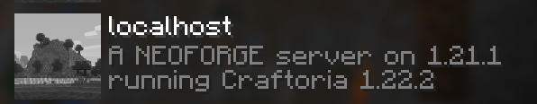

In order to unify management of the Minecraft server container, all of the [`server.properties`](https://minecraft.wiki/w/Server.properties) entries can be managed by the environment variables described in the sections below. Some of the mappings provide additional functionality above and beyond the properties file.

If you prefer to manually manage the `server.properties` file, set `OVERRIDE_SERVER_PROPERTIES` to "false". Similarly, you can entirely skip the startup script's creation of `server.properties` by setting `SKIP_SERVER_PROPERTIES` to "true".

!!! note
  
    To clear a server property, set the variable to an empty string, such as `-e RESOURCE_PACK=""`. An unset variable is ignored and the existing server property is left unchanged.

To see what `server.properties` will get used by the server, set the environment variable `DUMP_SERVER_PROPERTIES` to "true" and the contents of `server.properties` will get output before the server starts.

## Placeholders

When declaring a server properties via container environment variables, those values may contain placeholders that are processed when the `server.properties` file is updated. 

The syntax of placeholders is DOS-style, `%VAR%`, to avoid being processed by Docker or the shell and the following options are available:

`%VAR%` or `%env:VAR%`

: Replaced with the resolved value or the environment variable `VAR`

`%date:FMT%`

: Formats the current date/time with the given `FMT` string processed by [Java's DateTimeFormatter](https://docs.oracle.com/en/java/javase/11/docs/api/java.base/java/time/format/DateTimeFormatter.html).

Any declared or resolved environment variable may be referenced, such as `VERSION` and `TYPE`. Additionally, [Modrinth](../types-and-platforms/mod-platforms/modrinth-modpacks.md) and [Auto CurseForge](../types-and-platforms/mod-platforms/auto-curseforge.md) modpacks will expose the environment variables `MODPACK_NAME` and `MODPACK_VERSION`. The originally declared version, such as "LATEST" or "SNAPSHOT", is available in the variable `DECLARED_VERSION` 

!!! example

    As a compose file environment entry:

    ```yaml
        MOTD: Running %MODPACK_NAME% version %env:MODPACK_VERSION%
        LEVEL: world-%date:yyyy-MM-dd%
    ```

!!! warning

    Placeholders are not supported when manually managing `server.properties`

## Properties

### Message of the Day

The message of the day, shown below each server entry in the client UI, can be changed with the `MOTD` environment variable or a default is computed from the server type and version, such as

    A Paper Minecraft Server powered by Docker

That way you can easily differentiate between several server types you may have started.

The section symbol (§) and other unicode characters are automatically converted to allow [formatting codes](https://minecraft.wiki/w/Formatting_codes) to be used consistently with all server versions. For Minecraft versions less than 1.20, unicode characters in `server.properties` will be escaped as `\uXXXX`, by default. That behavior can be altered by setting `SERVER_PROPERTIES_ESCAPE_UNICODE` to "true" or "false".

!!! example

    With `docker run`
    
         -e MOTD="A §l§cMinecraft§r §nserver"
    
    or within a compose file
    
        environment:
          MOTD: "A §l§cMinecraft§r §nserver"

    renders
    
    

To produce a multi-line MOTD, embed a newline character as `\n` in the string, such as the following example.

!!! example "Multi-line MOTD"

    With `docker run`
    
    ```
    -e MOTD="Line one\nLine two"
    ```
    
    or within a compose file
    
    ```yaml
          MOTD: |
            line one
            line two
    # or
    #      MOTD: "line one\nline two"
    ```

The following example combines a multi-line MOTD with [placeholders](#placeholders) from the latest version of the installed modpack:

!!! example

    ```yaml
    MOD_PLATFORM: AUTO_CURSEFORGE
    CF_SLUG: craftoria
    MOTD: |
      A %TYPE% server on %VERSION%
      running %MODPACK_NAME% %MODPACK_VERSION%
    ```
    
    

### Difficulty

The difficulty level (default: `easy`) can be set like:

```
docker run -d -e DIFFICULTY=hard ...
```

Valid values are: `peaceful`, `easy`, `normal`, and `hard`, and an
error message will be output in the logs if it's not one of these
values.

Refer to [the Minecraft wiki](https://minecraft.wiki/w/Difficulty)

### Whitelist Players

!!! warning "For public servers" 
    
    It is very important to consider setting a whitelist of expected players.

To whitelist players for your Minecraft server, you can:  

- Provide a list of usernames and/or UUIDs separated by commas or newlines via the `WHITELIST` environment variable
- Provide the URL or container path to a whitelist file via `WHITELIST_FILE` that will be retrieved/copied into the standard location

!!! example 

    In a compose file, a text block can be used to improve maintainability, such as

    ```yaml
          WHITELIST: |
            user1
            user2
            user3
    ```

When either is set, [whitelisting of connecting users](https://minecraft.wiki/w/Server.properties#white-list) is enabled.

To change the behavior when the whitelist file already exists, set the variable `EXISTING_WHITELIST_FILE` to one of the following options:

`SKIP`
: Skip processing of the whitelist file when one is already present. This is the same as setting the legacy variable `OVERRIDE_WHITELIST` to "false".

`SYNCHRONIZE`
: Synchronize the list of users in the file with the `WHITELIST` or `WHITELIST_FILE` provided. When using both, `WHITELIST` will take precedence. This is the same as setting the legacy variable `OVERRIDE_WHITELIST` to "true".

`MERGE`
: Merge the list of users from `WHITELIST` into the existing file. `WHITELIST_FILE` cannot be used with this option.

`SYNC_FILE_MERGE_LIST` (default)
: When `WHITELIST_FILE` is provided it will overwrite an existing whitelist file. Also, if `WHITELIST` is provided, then those users will be merged into the newly copied file.

!!! note 

    For versions prior to 1.7.3, `white-list.txt` will be maintained instead. Only usernames are supported for those versions.

To [enforce the whitelist changes immediately](https://minecraft.wiki/w/Server.properties#enforce-whitelist) when whitelist commands are used , set `ENFORCE_WHITELIST` to "true". If managing the whitelist file manually, `ENABLE_WHITELIST` can be set to "true" to set the `white-list` property.

!!! tip "Changing user API provider"

    The usernames provided for whitelist and ops processing are resolved using either [PlayerDB](https://playerdb.co/) or [Mojang's API](https://wiki.vg/Mojang_API#Username_to_UUID). The default uses PlayerDB, but can be changed by setting the environment variable `USER_API_PROVIDER` to "mojang". Sometimes one or the other service can become overloaded, which is why there is the ability to switch providers.


### Op/Administrator Players

Similar to the whitelist, users can be provisioned as operators (aka administrators) to your Minecraft server by

- Providing a list of usernames and/or UUIDs separated by commas or newlines via the `OPS` environment variable
- Providing the URL or container path to an ops file via `OPS_FILE` that will be retrieved/copied into the standard location

!!! example

    In a compose file, a text block can be used to improve maintainability, such as

    ```yaml
          OPS: |
            user1
            user2
            user3
    ```

To change the behavior when the ops file already exists, set the variable `EXISTING_OPS_FILE` to one of the following options:

`SKIP`
: Skip processing of the ops file when one is already present. This is the same as setting the legacy variable `OVERRIDE_OPS` to "false".

`SYNCHRONIZE`
: Synchronize the list of users in the file with the `OPS` or `OPS_FILE` provided. When using both, `OPS` will take precedence. The `level` and `bypassesPlayerLimit` will be retained from previous entries. This is the same as setting the legacy variable `OVERRIDE_OPS` to "true".

`MERGE`
: Merge the list of users from `OPS` into the existing file. `OPS_FILE` cannot be used with this option.

`SYNC_FILE_MERGE_LIST` (default)
: When `OPS_FILE` is provided it will overwrite an existing ops file. Also, if `OPS` is provided, then those users will be merged into the newly copied file.

!!! note

    For versions prior to 1.7.3, `ops.txt` will be maintained instead. Only usernames are supported for those versions.

### Enable/disable initial selection of datapacks

New to [22W42A](https://www.minecraft.net/en-us/article/minecraft-snapshot-22w42a), datapacks with feature flags can be controlled before initial world creation by setting these to a comma separated list of packs:

- `INITIAL_ENABLED_PACKS`
  such as "update_1_20,bundle"
- `INITIAL_DISABLED_PACKS`

### Server icon

A server icon can be configured by setting the `ICON` variable to a URL to download or a container path. The image will be automatically downloaded (if a URL), scaled, and converted from any other image format:

!!! example

    Using `docker run`:
    
    ```
    docker run -d -e ICON=http://..../some/image.png ...
    ```
    
    In compose file:
    
    ```yaml
    environment:
      ICON: http://..../some/image.png
    ```
    
    Using a file from host filesystem:
    
    ```yaml
    environment:
      ICON: /icon.png
      OVERRIDE_ICON: true
    volumes:
      ./icon.png:/icon.png
    ```

By default an existing `server-icon.png` file will not be replaced, that can be changed by setting `OVERRIDE_ICON` to "true".

### RCON

RCON is **enabled by default** to allow for graceful shut down the server and coordination of save state during backups. RCON can be disabled by setting `ENABLE_RCON` to "false".

!!! warning

    Disabling RCON will remove and limit some features, such as interactive and color console support.

The default password is randomly generated on each startup; however, a specific one can be set with `RCON_PASSWORD`.

**DO NOT MAP THE RCON PORT EXTERNALLY** unless you are aware of all the consequences and have set a **secure password** with `RCON_PASSWORD`. 

!!! info 

    Mapping ports (`-p` command line or `ports` in compose) outside the container and docker networking needs to be a purposeful choice. Most production Docker deployments do not need any of the Minecraft ports mapped externally from the server itself.

By default, the server listens for RCON on port 25575 within the container. It can be changed with `RCON_PORT` but only do this if you have a very good reason. **DO NOT change `rcon.port` via `server.properties`** or integrations will break.

### Query

Set the environment variable `ENABLE_QUERY` to "true" to enable the gamespy query protocol. Maps to the server property [enable-query](https://minecraft.wiki/w/Server.properties#enable-query). By default, the query port will be `25565` (UDP) but can be changed with the `QUERY_PORT` environment variable.

### Level Seed

If you want to create the Minecraft level with a specific seed, set the environment variable `SEED`, which maps to the [level-seed](https://minecraft.wiki/w/Server.properties#level-seed) property.

If using a negative value for the seed, make sure to quote the value such as:

!!! example "Using docker run"

    ``` 
    -e SEED="-1785852800490497919"
    ```

!!! example "Using compose"

    ```yaml
    environment:
      SEED: "-1785852800490497919"
    ```

### Game Mode

By default, Minecraft servers are configured to run in Survival mode. You can
change the mode using `MODE` where you can either provide the [standard
numerical values](http://minecraft.wiki/Game_mode#Game_modes) or the
shortcut values:

- creative
- survival
- adventure
- spectator (only for Minecraft 1.8 or later)

For example:

    docker run -d -e MODE=creative ...

### Level Type and Generator Settings

By default, a standard world is generated with hills, valleys, water, etc. A different level type can
be configured by setting `LEVEL_TYPE` to [an expected type listed here](https://minecraft.wiki/w/Server.properties#level-type).

For some of the level types, `GENERATOR_SETTINGS` can be used to further customize the world generation.

To configure the `GENERATOR_SETTINGS` you need to add the appropriate `GeneratorOptions` JSON configuration. In the case of a superflat world, you may omit the `flat_world_options`.

The layers are applied from -64 and up and are added in the order of the list

Example for a superflat world:

- 1x bedrock
- 2x stone
- 15x sandstone
- Desert biome

```yaml
environment:
  LEVEL_TYPE: FLAT
  GENERATOR_SETTINGS: >-
      {
          "layers": [
              {
                  "block": "minecraft:bedrock",
                  "height": 1
              },
              {
                  "block": "minecraft:stone",
                  "height": 2
              },
              {
                  "block": "minecraft:sandstone",
                  "height": 15
              }
          ],
          "biome": "minecraft:desert"
      }
```
For more details, refer to the Minecraft Wiki sections for [Superflat Multiplayer](https://minecraft.wiki/w/Superflat#Multiplayer) and [generator options tag format](https://minecraft.wiki/w/Java_Edition_level_format#generatorOptions_tag_format).

### Custom Server Resource Pack

You can set a link to a custom resource pack and set it's checksum using the `RESOURCE_PACK` and `RESOURCE_PACK_SHA1` options respectively, the default is blank:

    docker run -d -e 'RESOURCE_PACK=http://link.com/to/pack.zip?=1' -e 'RESOURCE_PACK_SHA1=d5db29cd03a2ed055086cef9c31c252b4587d6d0'

You can enforce the resource pack on clients by setting `RESOURCE_PACK_ENFORCE` to `TRUE` (default: `FALSE`).

### Level / World Save Name

You can either switch between world saves or run multiple containers with different saves by using the `LEVEL` option,
where the default is "world":

    docker run -d -e LEVEL=bonus ...

> **NOTE:** if running multiple containers be sure to either specify a different `-v` host directory for each
`LEVEL` in use or don't use `-v` and the container's filesystem will keep things encapsulated.

> **INFO** Refer to the [data directory](../data-directory.md) section for a visual description of where the `$LEVEL` directory is situated.

### Server port

> **WARNING:** only change this value if you know what you're doing. It only needs to be changed when using host-networking and it is rare that host networking should be used. Use `-p` port mappings instead.

If you must, the server port can be set like:

!!! example "Using docker run"

    ```
    docker run -d -e SERVER_PORT=25566 ...
    ```

!!! example "Using compose"

    ```yaml
    environment:
      SERVER_PORT: 25566
    ```

**however**, be sure to change your port mapping accordingly and be prepared for some features to break.

### Custom server properties

Some mods/plugins utilize custom `server.properties` entries which can be declared via the `CUSTOM_SERVER_PROPERTIES` environment variable. The contents must be newline delimited `name=value` pairs.

Within a compose file, newline delimited entries can be declared as shown here:

```yaml
      CUSTOM_SERVER_PROPERTIES: |
        custom1=value1
        defaultworldgenerator-port=f8c04631-f744-11ec-b260-f02f74b094e0
```

When using `docker run` from a bash shell, the entries must be quoted with the `$'` syntax, such as

```
-e CUSTOM_SERVER_PROPERTIES=$'k1=v1\nk2=v2'
```

### Other server property mappings

| Environment Variable              | Server Property                                                                                                   |
|-----------------------------------|-------------------------------------------------------------------------------------------------------------------|
| ACCEPTS_TRANSFERS                 | [accepts-transfers](https://minecraft.wiki/w/Server.properties#accepts-transfers)                                 |
| ALLOW_FLIGHT                      | [allow-flight](https://minecraft.wiki/w/Server.properties#allow-flight)                                           |
| ALLOW_NETHER                      | [allow-nether](https://minecraft.wiki/w/Server.properties#allow-nether)                                           |
| BROADCAST_CONSOLE_TO_OPS          | [broadcast-console-to-ops](https://minecraft.wiki/w/Server.properties#broadcast-console-to-ops)                   |
| BROADCAST_RCON_TO_OPS             | [broadcast-rcon-to-ops](https://minecraft.wiki/w/Server.properties#broadcast-rcon-to-ops)                         |
| BUG_REPORT_LINK                   | [bug-report-link](https://minecraft.wiki/w/Server.properties#bug-report-link)                                     |
| ENABLE_COMMAND_BLOCK              | [enable-command-block](https://minecraft.wiki/w/Server.properties#enable-command-block)                           |
| ENABLE_STATUS                     | [enable-status](https://minecraft.wiki/w/Server.properties#enable-status)                                         |
| ENFORCE_SECURE_PROFILE            | [enforce-secure-profile](https://minecraft.wiki/w/Server.properties#enforce-secure-profile)                       |
| ENTITY_BROADCAST_RANGE_PERCENTAGE | [entity-broadcast-range-percentage](https://minecraft.wiki/w/Server.properties#entity-broadcast-range-percentage) |
| FORCE_GAMEMODE                    | [force-gamemode](https://minecraft.wiki/w/Server.properties#force-gamemode)                                       |
| FUNCTION_PERMISSION_LEVEL         | [function-permission-level](https://minecraft.wiki/w/Server.properties#function-permission-level)                 |
| GENERATE_STRUCTURES               | [generate-structures](https://minecraft.wiki/w/Server.properties#generate-structures)                             |
| HARDCORE                          | [hardcore](https://minecraft.wiki/w/Server.properties#hardcore)                                                   |
| HIDE_ONLINE_PLAYERS               | [hide-online-players](https://minecraft.wiki/w/Server.properties#hide-online-players)                             |
| LOG_IPS                           | [log-ips](https://minecraft.wiki/w/Server.properties#log-ips)                                                     |
| MAX_CHAINED_NEIGHBOR_UPDATES      | [max-chained-neighbor-updates](https://minecraft.wiki/w/Server.properties#max-chained-neighbor-updates)           |
| MAX_PLAYERS                       | [max-players](https://minecraft.wiki/w/Server.properties#max-players)                                             |
| MAX_TICK_TIME                     | [max-tick-time](https://minecraft.wiki/w/Server.properties#max-tick-time)                                         |
| MAX_WORLD_SIZE                    | [max-world-size](https://minecraft.wiki/w/Server.properties#max-world-size)                                       |
| NETWORK_COMPRESSION_THRESHOLD     | [network-compression-threshold](https://minecraft.wiki/w/Server.properties#network-compression-threshold)         |
| ONLINE_MODE                       | [online-mode](https://minecraft.wiki/w/Server.properties#online-mode)                                             |
| OP_PERMISSION_LEVEL               | [op-permission-level](https://minecraft.wiki/w/Server.properties#op-permission-level)                             |
| PAUSE_WHEN_EMPTY_SECONDS          | [pause-when-empty-seconds](https://minecraft.wiki/w/Server.properties#pause-when-empty-seconds)                   |
| PLAYER_IDLE_TIMEOUT               | [player-idle-timeout](https://minecraft.wiki/w/Server.properties#player-idle-timeout)                             |
| PREVENT_PROXY_CONNECTIONS         | [prevent-proxy-connections](https://minecraft.wiki/w/Server.properties#prevent-proxy-connections)                 |
| PVP                               | [pvp](https://minecraft.wiki/w/Server.properties#pvp)                                                             |
| RATE_LIMIT                        | [rate-limit](https://minecraft.wiki/w/Server.properties#rate-limit)                                               |
| REGION_FILE_COMPRESSION           | [region-file-compression](https://minecraft.wiki/w/Server.properties#region-file-compression)                     |   
| RESOURCE_PACK_ID                  | [resource-pack-id](https://minecraft.wiki/w/Server.properties#resource-pack-id)                                   |
| RESOURCE_PACK_PROMPT              | [resource-pack-prompt](https://minecraft.wiki/w/Server.properties#resource-pack-prompt)                           |
| SERVER_NAME                       | [server-name](https://minecraft.wiki/w/Server.properties#server-name)                                             |
| SIMULATION_DISTANCE               | [simulation-distance](https://minecraft.wiki/w/Server.properties#simulation-distance)                             |
| SPAWN_MONSTERS                    | [spawn-monsters](https://minecraft.wiki/w/Server.properties#spawn-monsters)                                       |
| SPAWN_PROTECTION                  | [spawn-protection](https://minecraft.wiki/w/Server.properties#spawn-protection)                                   |
| SYNC_CHUNK_WRITES                 | [sync-chunk-writes](https://minecraft.wiki/w/Server.properties#sync-chunk-writes)                                 |
| USE_NATIVE_TRANSPORT              | [use-native-transport](https://minecraft.wiki/w/Server.properties#use-native-transport)                           |
| VIEW_DISTANCE                     | [view-distance](https://minecraft.wiki/w/Server.properties#view-distance)                                         |