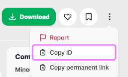

# Auto-download from Modrinth

[Modrinth](https://modrinth.com/) is an open source modding platform with a clean, easy to use website for finding [Fabric, Forge, etc mods](https://modrinth.com/mods) and [Paper, etc plugins](https://modrinth.com/plugins), and [datapacks](https://modrinth.com/datapacks). At startup, the container will automatically locate and download the newest versions of mod/plugin files that correspond to the `TYPE` and `VERSION` in use. Older file versions downloaded previously will automatically be cleaned up.

## Usage

To use this feature, set the environment variable `MODRINTH_PROJECTS` to a comma or newline separated list of projects.  

Each project entry can be any of the following combinations where a colon (`:`) is used to separate the different parts:

```
         Project
         Project : Version
         Project : Release Type
Prefix : Project
Prefix : Project : Version
Prefix : Project : Release Type
@ Listing File
```

Where:

- **Project** is the project slug or ID, see below
- **Version** is the version ID (such as "Oa9ZDzZq") or number (such as "2.21.2"). When omitted, the latest release version will be selected. Using version ID will override Minecraft and loader compatibility checks.
- **Release Type** is `release`, `beta`, or `alpha` indicating the latest version to select.
- **Prefix** is `datapack`, `fabric`, `forge`, or `paper`
    - The `datapack` prefix is optional when running a vanilla server
    - The `fabric`, `forge`, and `paper` prefixes allow for installing mods/plugins that differ from server's `TYPE`. Using [Sinytra Connector](https://modrinth.com/mod/connector) is an example of this, where Fabric mods can be loaded into a NeoForge server.
- **Listing file** is a container path to a file containing a list of projects

!!! tip "Project ID"

    The project ID can be copied to the clipboard from the project page menu:

    

!!! tip "Project Slug"

    The project slug is the part of the URL that follows `/mod/`, `/plugin/`, or `/datapack/`. For example, this one is "essentialsx".

    

!!! tip "Version number and ID"

    The version number and ID are located in the metadata panel on a version specific page, such as <https://modrinth.com/plugin/essentialsx/version/2.21.2>

    

### Examples
            
| Description                     | Example projects entry                                |
|---------------------------------|-------------------------------------------------------|
| Select latest version           | `fabric-api`                                          |
| Select specific version         | `fabric-api:bQZpGIz0`<br/>`fabric-api:0.119.2+1.21.4` |
| Select latest beta version      | `fabric-api:beta`                                     |
| Latest version using project ID | `P7dR8mSH`                                            |
| Latest version of datapack      | `datapack:terralith`                                  |
| Specific version of datapack    | `datapack:terralith:2.5.5`                            |
| Mod loader override             | `fabric:fabric-api`<br/>`fabric:fabric-api:bQZpGIz0`  |
| Projects Listing File           | `@/path/to/modrinth-mods.txt`                         |

### Notes

!!! info "More about listing files"

    Each line in the listing file is processed as one of the references above; however, blank lines and comments that start with `#` are ignored.
    
    Make sure to place the listing file in a mounted directory/volume or declare an appropriate mount for it.
    
    For example, `MODRINTH_PROJECTS` can be set to "@/extras/modrinth-mods.txt", assuming "/extras" has been added to `volumes` section, where the container file `/extras/modrinth-mods.txt` contains
    
    ```text
    # This comment is ignored
    fabric-api
    
    # This and previous blank line are ignore
    cloth-config
    datapack:terralith
    ```

!!! note "Auto-removal"

    Entries that are removed from the `MODRINTH_PROJECTS` list will be automatically removed from the `mods` or `plugins` directory. This is useful for removing mods/plugins that are no longer needed. An empty `MODRINTH_PROJECTS` list will remove all mods/plugins.

!!! note "Disable processing"

    To temporarily disable processing of the `MODRINTH_PROJECTS` list, then comment out the `MODRINTH_PROJECTS` environment variable.

## Version from Projects

When the environment variable `VERSION_FROM_MODRINTH_PROJECTS` is set to "true" the Minecraft [`VERSION`](../versions/minecraft.md) will be automatically determined by looking at the most recent version of Minecraft that is supported by all the projects provided in `MODRINTH_PROJECTS`.

!!! example

    Given the environment variables
    
    ```yaml
        MODRINTH_PROJECTS: |
          viaversion
          viabackwards
          griefprevention
          discordsrv
        VERSION_FROM_MODRINTH_PROJECTS: true
    ```
    
    Let's say all are supported on Minecraft up to 1.21.8 except griefprevention, which is only supported up to 1.21.7. In that case, `VERSION` will be automatically set to 1.21.7.

## Extra options

`MODRINTH_DOWNLOAD_DEPENDENCIES`
: Can be set to `none` (the default), `required`, or `optional` to download required and/or optional dependencies.

`MODRINTH_PROJECTS_DEFAULT_VERSION_TYPE`
: The version type is used to determine the newest version to use from each project. The allowed values are `release` (default), `beta`, `alpha`. Setting to `beta` will pick up both release and beta versions. Setting to `alpha` will pick up release, beta, and alpha versions.

`MODRINTH_LOADER`
: When using a custom server, set this to specify which loader type will be requested during lookups

