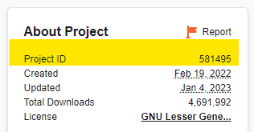

# Auto CurseForge

To manage a CurseForge modpack automatically with upgrade support, pinned or latest version tracking, set `MOD_PLATFORM` or `TYPE` to "AUTO_CURSEFORGE". The appropriate mod loader (Forge / Fabric) version will be automatically installed as declared by the modpack. This mode will also take care of cleaning up unused files installed by previous versions of the modpack, but world data is never auto-removed.

## API Key

!!! warning "CurseForge API key usage"

    A CurseForge API key is **required** to use this feature. Go to their [developer console](https://console.curseforge.com/), generate an API key, and set the environment variable `CF_API_KEY`.
    
    When entering your API Key in a docker compose file you will need to escape any `$` character with a second `$`.
    
    Example if your key is `$11$22$33aaaaaaaaaaaaaaaaaaaaaaaaaa`:
    ```yaml
    environment:
      CF_API_KEY: '$$11$$22$$33aaaaaaaaaaaaaaaaaaaaaaaaaa'
    ```
    If you use `docker run` you will need to make sure to use single quotes:
    
    ```shell
    docker run ... -e CF_API_KEY='$11$22$33aaaaaaaaaaaaaaaaaaaaaaaaaa'
    ```
    
    To avoid exposing the API key, it is highly recommended to use a `.env` file, which is [loaded automatically by docker compose](https://docs.docker.com/compose/environment-variables/set-environment-variables/#substitute-with-an-env-file). `$`'s in the value still need to escaped with a second `$` and the variable needs to be referenced from the compose file, such as:
    ```yaml
    environment:
      CF_API_KEY: ${CF_API_KEY}
    ```
    
    To use the equivalent with `docker run` you need to specify the `.env` file explicitly:
    ```
    docker run --env-file=.env itzg/minecraft-server
    ```

!!! note
    Be sure to use the appropriate [image tag for the Java version compatible with the modpack](../../versions/java.md).
    
    Most modpacks require a good amount of memory, so it best to set `MEMORY` to at least "4G" since the default is only 1 GB.

## Usage

Use one of the following to specify the modpack to install:

Pass a page URL to the modpack or a specific file with `CF_PAGE_URL` such as the modpack page "https://www.curseforge.com/minecraft/modpacks/all-the-mods-8" or a specific file "https://www.curseforge.com/minecraft/modpacks/all-the-mods-8/files/4248390". For example:

```
-e TYPE=AUTO_CURSEFORGE -e CF_PAGE_URL=https://www.curseforge.com/minecraft/modpacks/all-the-mods-8
```

Instead of a URL, the modpack slug can be provided as `CF_SLUG`. The slug is the short identifier visible in the URL after "/modpacks/", such as


For example:
```
-e TYPE=AUTO_CURSEFORGE -e CF_SLUG=all-the-mods-8
```

For mod, modpacks, and world files that are not allowed for automated download, the container path `/downloads` can be attached and matching files will be retrieved from there. The subdirectories `mods`, `modpacks`, and `worlds` will also be checked accordingly. To change the source location of downloaded files, set `CF_DOWNLOADS_REPO` to an existing container path. To disable this feature, set `CF_DOWNLOADS_REPO` to an empty string.

If the authors of the modpack have disallowed project distribution, then the desired **client** modpack zip will need to be manually downloaded and made available to the container. The path to that file must be passed to `CF_MODPACK_ZIP`. Similarly, the container path to a modpack manifest JSON can be passed to `CF_MODPACK_MANIFEST`.  In either case, the modpack slug or page URL must still be provided.

The latest file will be located and used by default, but if a specific version is desired you can use one of the following options. With any of these options **do not select a server file** -- they lack the required manifest and defeat the ability to consistently automate startup.

- Use `CF_PAGE_URL`, but include the full URL to a specific file
- Set `CF_FILE_ID` to the numerical file ID
- Specify a substring to match the desired filename with `CF_FILENAME_MATCHER`

The following shows where to get the URL to the specific file and also shows where the file ID is located:


The following examples all refer to version 1.0.7 of ATM8:

```
-e CF_PAGE_URL=https://www.curseforge.com/minecraft/modpacks/all-the-mods-8/files/4248390
```

```
-e CF_SLUG=all-the-mods-8 -e CF_FILE_ID=4248390
```

```
-e CF_SLUG=all-the-mods-8 -e CF_FILENAME_MATCHER=1.0.7
```

## Exlude client mods

Quite often there are mods that need to be excluded, such as ones that did not properly declare as a client mod via the file's game versions. Similarly, there are some mods that are incorrectly tagged as client only. The following describes two options to exclude/include mods:

Mods can be excluded by passing a comma or space delimited list of **project** slugs or IDs via `CF_EXCLUDE_MODS`. Similarly, there are some mods that are incorrectly tagged as client only. For those, pass the **project** slugs or IDs via `CF_FORCE_INCLUDE_MODS`. These lists will be combined with the content of the exclude/include file, if given.

A mod's project ID can be obtained from the right hand side of the project page:


For more complex scenarios, global and per modpack exclusions can be declared in a container-accessible JSON file and referenced with `CF_EXCLUDE_INCLUDE_FILE`. By default, [the file bundled with the image](https://raw.githubusercontent.com/itzg/docker-minecraft-server/master/files/cf-exclude-include.json) will be used, but can be disabled by setting this to an empty string. The schema of this file [is documented here](https://github.com/itzg/mc-image-helper#excludeinclude-file-schema).

If needing to iterate on the options above, set `CF_FORCE_SYNCHRONIZE` to "true" to ensure the exclude/includes are re-evaluated.

!!! important
These options are provided to empower you to get your server up and running quickly. Please help out by reporting an issue with the respective mod project. Ideally mod developers should [use correct registrations for one-sided client mods](https://docs.minecraftforge.net/en/latest/concepts/sides/#writing-one-sided-mods). Understandably, those code changes may be non-trivial, so mod authors can also add "Client" to the game versions when publishing.

## Extra options

Some modpacks come with world/save data via a worlds file and/or the overrides provided with the modpack. Either approach can be selected to set the `LEVEL` to the resulting saves directory by setting `CF_SET_LEVEL_FROM` to either:
- `WORLD_FILE`
- `OVERRIDES`

Other configuration available:
- `CF_PARALLEL_DOWNLOADS` (default is 4): specify how many parallel mod downloads to perform
- `CF_OVERRIDES_SKIP_EXISTING` (default is false): if set, files in the overrides that already exist in the data directory are skipped. **NOTE** world data is always skipped, if present.
